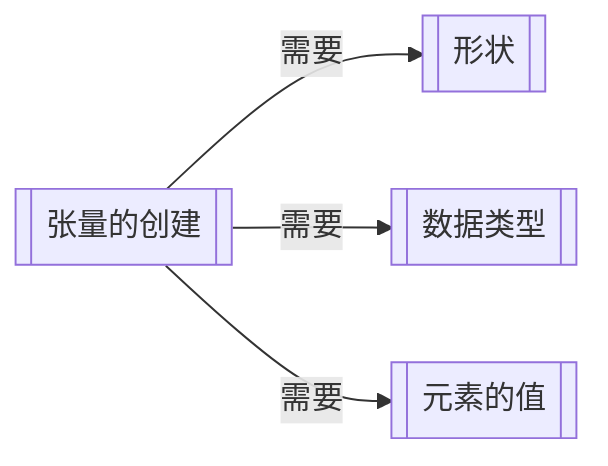

# `torch`及`torch.tensor`常见操作及示范

## 前情提要

**说明1**

张量是一个多维数组，可以是标量、向量、矩阵或者更高维度的数据结构。在Pytorch中，张量支持多种数据类型（整型、浮点型、布尔型等）。张量可以存储在 CPU 或 GPU 中，GPU 张量可显著加速计算。

根据维度的不同，可以将张量分为1D、2D、3D...的张量。常见的：2D张量为单通道的图片；3D张量为多通道，例如RGB图片；4D张量为视频帧。

**说明2**

**张量的维度排列顺序可以粗浅的理解为，遵循某种程度的右手准则。新的维度在旧的维度左边，越左的维度代表越新。**

**说明3**

张量的创建：讲述如何创建一个新的张量对象

张量的属性：在不改变某个张量的前提下，输出其的特征

张量的查询：在不改变某个张量的前提下，输出其元素的值

单张量的修改：针对**某个**张量，将其修改为一个不同的张量

多张量的操作：针对**多个**张量，将其操作为一个不同的张量

## 张量的创建



形状的定义

Pytorch中有16种不同类型的数据，如下表所示：

| 数据类型                                                     | dtype                               | 传统构造函数             |
| ------------------------------------------------------------ | ----------------------------------- | ------------------------ |
| 32 位浮点数                                                  | `torch.float32`或`torch.float`      | `torch.*.FloatTensor`    |
| 64 位浮点数                                                  | `torch.float64`或`torch.double`     | `torch.*.DoubleTensor`   |
| 64 位复数                                                    | `torch.complex64`或`torch.cfloat`   |                          |
| 128 位复数                                                   | `torch.complex128`或`torch.cdouble` |                          |
| 16 位浮点数 [1](https://pytorch.ac.cn/docs/stable/tensor_attributes.html#id3) | `torch.float16`或`torch.half`       | `torch.*.HalfTensor`     |
| 16 位浮点数 [2](https://pytorch.ac.cn/docs/stable/tensor_attributes.html#id4) | `torch.bfloat16`                    | `torch.*.BFloat16Tensor` |
| 8 位无符号整数                                               | `torch.uint8`                       | `torch.*.ByteTensor`     |
| 8 位有符号整数                                               | `torch.int8`                        | `torch.*.CharTensor`     |
| 16 位有符号整数                                              | `torch.int16`或`torch.short`        | `torch.*.ShortTensor`    |
| 32 位有符号整数                                              | `torch.int32`或`torch.int`          | `torch.*.IntTensor`      |
| 64 位有符号整数                                              | `torch.int64`或`torch.long`         | `torch.*.LongTensor`     |
| 布尔型                                                       | `torch.bool`                        | `torch.*.BoolTensor`     |

### `torch.tensor()`

**说明**

* 可以从`Python`列表或`Numpy`数组创建张量。

### `torch.zeros()`--CONSTRUCT

**说明**

`torch.zeros(*size, *, out=None, dtype=None, layout=torch.strided, device=None, requires_grad=False) -> Tensor`

* 创建特定形状的，特定数据类型的，值全部为0的张量。
* `*size`：以解包的方式接受有关张量形状的参数
* `*`：表示后面的参数都必须以关键字参数的形式出现
* `dtype`：返回张量的数据类型，如果`None`，则使用全局默认[`torch.set_default_dtype()`](https://pytorch.ac.cn/docs/stable/generated/torch.set_default_dtype.html#torch.set_default_dtype)。
* `layout`：返回张量所需的布局，`torch.strided`表示采用密集张量。
* `device`： 返回张量所需的设备。如果`None`，则使用默认的当前设备 [`torch.set_default_device()`](https://pytorch.ac.cn/docs/stable/generated/torch.set_default_device.html#torch.set_default_device)。对于 CPU 张量类型，`device`将是 CPU；对于 CUDA 张量类型，`device`将是当前 CUDA 设备。

**演示**

```python
>>> import torch
>>> torch.zeros(1,2,3)
tensor([[[0., 0., 0.],
         [0., 0., 0.]]])
>>> torch.zeros(3,3,3)
tensor([[[0., 0., 0.],
         [0., 0., 0.],
         [0., 0., 0.]],

        [[0., 0., 0.],
         [0., 0., 0.],
         [0., 0., 0.]],

        [[0., 0., 0.],
         [0., 0., 0.],
         [0., 0., 0.]]])
```

### `torch.ones()`--CONSTRUCT

**说明**

`torch.ones(*size, *, out=None, dtype=None, layout=torch.strided, device=None, requires_grad=False)->Tensor`

* 与`torch.zeros()`类似，只是填充的值从0变为1。
* 其他参数参见`torch.zeros()`

**演示**

```python
>>> torch.ones(1,2,3)
tensor([[[1., 1., 1.],
         [1., 1., 1.]]])
>>> torch.ones(3,3,3)
tensor([[[1., 1., 1.],
         [1., 1., 1.],
         [1., 1., 1.]],

        [[1., 1., 1.],
         [1., 1., 1.],
         [1., 1., 1.]],

        [[1., 1., 1.],
         [1., 1., 1.],
         [1., 1., 1.]]])
```

### `torch.eye()`--CONSTRUCT

**说明**

`torch.eye(n, m=None, *, out=None, dtype=None, layout=torch.strided, device=None, requires_grad=False)->Tensor`

* 返回对角线上为 1，其他地方为 0 的二维张量。
* `n`：表示行的数量
* `m`：表示列的数量，若未规定，则`m=n`。

**演示**

```python
>>> torch.eye(3,2)
tensor([[1., 0.],
        [0., 1.],
        [0., 0.]])
>>> torch.eye(3)
tensor([[1., 0., 0.],
        [0., 1., 0.],
        [0., 0., 1.]])
>>> torch.eye(3,3,3)
Traceback (most recent call last):
  File "<stdin>", line 1, in <module>
TypeError: eye() received an invalid combination of arguments - got (int, int, int), but expected one of:
 * (int n, *, Tensor out = None, torch.dtype dtype = None, torch.layout layout = None, torch.device device = None, bool pin_memory = False, bool requires_grad = False)
 * (int n, int m, *, Tensor out = None, torch.dtype dtype = None, torch.layout layout = None, torch.device device = None, bool pin_memory = False, bool requires_grad = False)
# 报错，只能产生2D张量
```

### `torch.empty()`--CONSTRUCT

**说明**

`torch.empty(*size, *, out=None, dtype=None, layout=torch.strided, device=None, requires_grad=False, pin_memory=False, memory_format=torch.contiguous_format)->Tensor`

* 返回一个充满未初始化数据的张量，张量的形状由变量参数`size`定义。
* `pin_memory`：如果设置，返回的张量将被分配到固定的内存中，仅适用于 CPU 张量，默认值为`False`。[Dataloader中pin_memory参数的使用及注意事项_pin memory-CSDN博客](https://blog.csdn.net/qq_38100666/article/details/134257397)
* `memory_format`：返回张量所需的内存格式，默认为`torch.contiguous_format`。

**演示**

```python
>>> torch.empty(1,2,3)
tensor([[[9.8682e-32, 1.9997e-42, 0.0000e+00],
         [0.0000e+00, 0.0000e+00, 0.0000e+00]]])
>>> torch.empty(3,3,3)
tensor([[[1.0093e-31, 1.9997e-42, 0.0000e+00],
         [0.0000e+00, 0.0000e+00, 0.0000e+00],
         [0.0000e+00, 0.0000e+00, 0.0000e+00]],

        [[0.0000e+00, 0.0000e+00, 0.0000e+00],
         [0.0000e+00, 0.0000e+00, 0.0000e+00],
         [0.0000e+00, 0.0000e+00, 0.0000e+00]],

        [[0.0000e+00, 0.0000e+00, 0.0000e+00],
         [0.0000e+00, 0.0000e+00, 0.0000e+00],
         [0.0000e+00, 0.0000e+00, 0.0000e+00]]])
```

### `torch.arange()`--CONSTRUCT

**说明**

`torch.arange(start=0, end, step=1, *, out=None, dtype=None, layout=torch.strided, device=None, requires_grad=False)->Tensor`

* 返回一个大小为$ \frac{end−start}{step} $的**一维张量**，其值从区间 $[start, end)$中获取，以$ start $为起始值，公差为 $step$。
* 使用浮点型 dtypes时，结果可能会受到浮点数舍入行为的影响。对于精确的序列，建议使用整型 dtypes 而非浮点型 dtypes。
* 与end相比较时，非整数step容易受浮点舍入错误的影响，为了避免这种不一致，建议在这种情况下添加一个小的epsilon。

**演示**

```python
>>> torch.arange(1,5,1)
tensor([1, 2, 3, 4])
>>> torch.arange(1,5,0.5)
tensor([1.0000, 1.5000, 2.0000, 2.5000, 3.0000, 3.5000, 4.0000, 4.5000])
```

### `torch.rand()`--CONSTRUCT

**说明**

`torch.rand(*size, *, generator=None, out=None, dtype=None, layout=torch.strided, device=None, requires_grad=False, pin_memory=False)->Tensor`

* 返回一个填充了在区间 $[0,1)$ 上均匀分布的随机数的张量，张量的形状由可变参数`size`定义。
* `generator`：用于采样的伪随机数生成器。

**演示**

```python
>>> torch.rand(1,2,3)
tensor([[[0.0729, 0.7020, 0.9921],
         [0.9064, 0.0083, 0.1626]]])
>>> torch.rand(3,3,3)
tensor([[[0.8848, 0.0203, 0.9415],
         [0.1521, 0.1396, 0.7506],
         [0.0855, 0.8669, 0.2499]],

        [[0.2778, 0.6369, 0.4386],
         [0.4636, 0.6780, 0.4131],
         [0.3824, 0.9742, 0.9148]],

        [[0.1709, 0.1140, 0.5728],
         [0.5518, 0.9048, 0.9019],
         [0.9717, 0.5595, 0.1032]]])
```

### `torch.randn()`--CONSTRUCT

**说明**

`torch.randn(*size, *, generator=None, out=None, dtype=None, layout=torch.strided, device=None, requires_grad=False, pin_memory=False)->Tensor`

* 返回一个张量，其元素是从均值为 0、方差为 1 的正态分布（也称为标准正态分布）中随机采样得到的。

**演示**

```python
>>> torch.randn(1,2,3)
tensor([[[ 0.2430, -0.0071,  0.1733],
         [-0.4769,  0.4720,  0.5144]]])
>>> torch.randn(3,3,3)
tensor([[[-2.1882, -0.5600, -0.4498],
         [ 0.3474, -1.9026,  2.1841],
         [-0.2960,  0.8770, -0.2157]],

        [[-0.2676,  1.0478, -0.3109],
         [-0.1332,  0.3394,  0.0650],
         [ 1.6646,  0.4142, -0.5948]],

        [[ 2.8440,  0.5464, -1.0305],
         [-0.2726, -0.9010,  0.2080],
         [-0.0206,  0.5681,  0.1159]]])
```

### `torch.linspace()`--CONSTRUCT

**说明**

`torch.linspace(start, end, steps, *, out=None, dtype=None, layout=torch.strided, device=None, requires_grad=False)->Torch`

* 创建一个大小为 $steps$ 的**一维张量**，其值在 $start$ 和 $end$之间均匀间隔（包含端点）。也就是说，这些值是$(start,start+\frac{end-start}{steps-1},...,start+(steps-2)*\frac{end-start}{steps-1},end)$

**演示**

```python
>>> torch.linspace(1,2,5)
tensor([1.0000, 1.2500, 1.5000, 1.7500, 2.0000])
>>> torch.linspace(1,2,8)
tensor([1.0000, 1.1429, 1.2857, 1.4286, 1.5714, 1.7143, 1.8571, 2.0000])
```

### `torch.clone`/`.clone()`

**说明**

`Tensor.clone(*, memory_format=torch.preserve_format) ->Tensor`

* 参见`torch.clone(input, *, memory_format=torch.preserve_format)`
* 返回一个`input`的副本

**演示**

```python
>>> a
tensor([ 1.1251,  0.4808, -0.9569])
>>> b = a.clone()
>>> b
tensor([ 1.1251,  0.4808, -0.9569])
```

### `.copy_()`

**说明**

`Tensor.copy_(src, non_blocking=False)->Tensor`

* `src`：要从中复制的源张量
* `non_blocking`：如果为`True`且此复制发生在 CPU 和 GPU 之间，则复制可能相对于主机异步发生。对于其他情况，此参数无效。

**演示**

```python
>>> a = torch.randn(3)
>>> a
tensor([ 1.1251,  0.4808, -0.9569])
>>> c = torch.randn(3)
>>> c
tensor([ 1.8197, -0.4520, -1.7042])
>>> c.copy_(a)
tensor([ 1.1251,  0.4808, -0.9569])
>>> c
tensor([ 1.1251,  0.4808, -0.9569])
```

## 张量的属性

### `.shape`

**说明**

`class tensor.shape`

* 返回`self`张量的大小。它是`size`的别名。

**演示**

```python
>>> t = torch.empty(3,4,5)
>>> t.shape
torch.Size([3, 4, 5])
>>> t.size()
torch.Size([3, 4, 5])
```

### `.size()`

**说明**

`Tensor.size(dim=None)->torch.Size or int`

**演示**

```python
>>> t = torch.empty(3,4,5)
>>> t.size()
torch.Size([3, 4, 5])
>>> t.size(2)
5
>>> t.size(0)
3
```

### `.dtype`

**说明**

`class torch.dtype`

* 返回12种数据类型之一。

**演示**

```python
>>> t.dtype
torch.float32
>>> t.dtype()
Traceback (most recent call last):
  File "<stdin>", line 1, in <module>
TypeError: 'torch.dtype' object is not callable
```

### `.device`

**说明**

`class torch.device`

* 一个`torch.device`对象表示分配`torch.Tensor`设备或将要分配的设备。
* `torch.device`包含一个设备类型（最常见的是cpu或cuda，但也可能是[“mps”](https://pytorch.ac.cn/docs/stable/mps.html)、[“xpu”](https://pytorch.ac.cn/docs/stable/xpu.html)、[“xla”](https://github.com/pytorch/xla/)或[“meta”](https://pytorch.ac.cn/docs/stable/meta.html)）

**演示**

```python
>>> t.device
device(type='cpu')
```

### `.layout`

**说明**

`class torch.layout`

* 一个`torch.layout`对象表示一个`torch.Tensor`的内存布局。目前，我们`Pytorch`支持`torch.strided`（密集张量），并对`torch.sparse_coo`（稀疏 COO 张量）提供 beta 支持。
* `torch.strided`表示密集张量，是目前最常用的内存布局，每个张量都关联一个`torch.Storage`，用于存储其数据。这些张量提供存储的多维、跨步视图。跨步（Strides）是一组整数：第 k 个跨步表示在张量的第 k 维中从一个元素移动到下一个元素所需的内存跳转。

### `.dim()`

**说明**

`Tensor.dim()->int`

* 返回`self`张量的维度数量

**演示**

```python
>>> t
tensor([[[1.0173e-31, 1.9997e-42, 0.0000e+00, 0.0000e+00, 0.0000e+00],
         [0.0000e+00, 0.0000e+00, 0.0000e+00, 0.0000e+00, 0.0000e+00],
         [0.0000e+00, 0.0000e+00, 0.0000e+00, 0.0000e+00, 0.0000e+00],
         [0.0000e+00, 0.0000e+00, 0.0000e+00, 0.0000e+00, 0.0000e+00]],

        [[0.0000e+00, 0.0000e+00, 0.0000e+00, 0.0000e+00, 0.0000e+00],
         [0.0000e+00, 0.0000e+00, 0.0000e+00, 0.0000e+00, 0.0000e+00],
         [0.0000e+00, 0.0000e+00, 0.0000e+00, 0.0000e+00, 0.0000e+00],
         [0.0000e+00, 0.0000e+00, 0.0000e+00, 0.0000e+00, 0.0000e+00]],

        [[0.0000e+00, 0.0000e+00, 0.0000e+00, 0.0000e+00, 0.0000e+00],
         [0.0000e+00, 0.0000e+00, 0.0000e+00, 0.0000e+00, 0.0000e+00],
         [0.0000e+00, 0.0000e+00, 0.0000e+00, 0.0000e+00, 0.0000e+00],
         [0.0000e+00, 0.0000e+00, 0.0000e+00, 0.0000e+00, 0.0000e+00]]])
>>> t.dim()
3
>>> t.shape
torch.Size([3, 4, 5])
```

### `.requires_grad`

**说明**

`Tensor.requires_grad`

* 如果此 Tensor 需要计算梯度，则为`True`，否则为`False`。

**演示**

```python
>>> a = torch.ones(3,3)
>>> a
tensor([[1., 1., 1.],
        [1., 1., 1.],
        [1., 1., 1.]])
>>> a.requires_grad
False
```

### `torch.numel()`

**说明**

`torch.numel(input: [Tensor])->int`

* 返回`input`张量中的元素总数。

**演示**

```python
>>> a = torch.ones(3,4,5)
>>> torch.numel(a)
60 # 60=3*4*5
```

### `.is_cuda`

**说明**

`Tensor.is_cuda`

* 如果张量存储在 GPU 上则为`True`，否则为`False`。

**演示**

```python
>>> a = torch.ones(3,4,5)
>>> a.is_cuda
False
```

### `torch.max()`/`.max()`

**说明**

`torch.max(input)->Tensor`

* 返回`input`张量中所有元素的最大值。

`torch.max(input, dim, keepdim=False, *, out=None)`

* 返回一个命名元组`(values, indices)`，其中`values`是`input`张量在给定维度`dim`上**每行**的最大值`indices`是找到的每个最大值的索引位置 (argmax)。即，沿着`dim`维度坍缩。
* `input`：输入张量
* `dim`：`int`或`int`的`tuple`，要缩减的维度，如果为`None`，则所有维度都将缩减。
* `keepdim`：`bool`类型，输出的张量是否要保留`dim`维度。如果`keepdim`为`True`，则输出张量的大小与`input`相同，除了维度`dim`的大小为 1。否则，维度`dim`会被压缩，导致输出张量的维度比`input`少 1。
* 也可以用作一种**类方法**使用，`.max(dim,keepdim=False)`。

`torch.max(input, other, *, out=None)->Tensor`

* 同样可用作`torch.maximum(input, other, *, out=None)`。
* 计算`input`和`other`的逐元素最大值。
* 如果比较的元素之一是`NaN`，则返回该元素。具有复数`dtype`的`Tensor`不支持 。
* `input`， 输入的Tensor；`other`，第二个输入 Tensor。

**演示**

```python
>>> a = torch.randn(3,3,3)
>>> a
tensor([[[-0.9897,  0.4273, -1.5074],
         [-1.4994, -0.4894, -0.0919],
         [ 1.0821, -0.0894, -0.2159]],

        [[ 0.9338, -1.2069, -1.3077],
         [-1.6527, -0.8418,  1.0278],
         [ 0.4279, -0.4402, -0.2955]],

        [[-0.4428,  0.4368,  1.2221],
         [-2.1447,  1.0600,  0.5899],
         [-0.7811, -0.5964, -2.5749]]])
# 1
>>> torch.max(a)
tensor(1.2221)
# 2
>>> torch.max(a,2)
torch.return_types.max(
values=tensor([[ 0.4273, -0.0919,  1.0821],
        [ 0.9338,  1.0278,  0.4279],
        [ 1.2221,  1.0600, -0.5964]]),
indices=tensor([[1, 2, 0],
        [0, 2, 0],
        [2, 1, 1]]))
# 3
>>> torch.max(a,0)
torch.return_types.max(
values=tensor([[ 0.9338,  0.4368,  1.2221],
        [-1.4994,  1.0600,  1.0278],
        [ 1.0821, -0.0894, -0.2159]]),
indices=tensor([[1, 2, 2],
        [0, 2, 1],
        [0, 0, 0]]))
# 4
>>> torch.max(a,0,True)
torch.return_types.max(
values=tensor([[[ 0.9338,  0.4368,  1.2221],
         [-1.4994,  1.0600,  1.0278],
         [ 1.0821, -0.0894, -0.2159]]]),
indices=tensor([[[1, 2, 2],
         [0, 2, 1],
         [0, 0, 0]]]))
# 5
>>> b = torch.randn(3,3,3)
>>> b
tensor([[[-0.8746, -0.5400,  0.9841],
         [-0.5762, -0.7205, -0.3110],
         [-0.0045,  0.5542, -0.1664]],

        [[-1.4495, -0.1624,  0.6118],
         [ 0.5968,  1.0477,  1.0774],
         [ 0.9888, -0.5759,  0.5254]],

        [[ 1.2315, -1.3451,  0.3362],
         [ 2.0483,  1.5623,  0.9542],
         [ 1.7434,  0.6964, -0.1850]]])
>>> torch.max(a,b)
tensor([[[-0.8746,  0.4273,  0.9841],
         [-0.5762, -0.4894, -0.0919],
         [ 1.0821,  0.5542, -0.1664]],

        [[ 0.9338, -0.1624,  0.6118],
         [ 0.5968,  1.0477,  1.0774],
         [ 0.9888, -0.4402,  0.5254]],

        [[ 1.2315,  0.4368,  1.2221],
         [ 2.0483,  1.5623,  0.9542],
         [ 1.7434,  0.6964, -0.1850]]])
```

### `torch.min()`/`.min()`

`torch.min(input)->Tensor`

* 同`torch.max(input)->Tensor`

`torch.min(input, dim, keepdim=False, *, out=None)`

* 同`torch.max(input, dim, keepdim=False, *, out=None)`

`torch.min(input, other, *, out=None) ->Tensor`

* 同`torch.max(input, other, *, out=None) ->Tensor`

### `torch.topk()`/`.topk()`

**说明**

`torch.topk(input, k, dim=None, largest=True, sorted=True, *, out=None)`

* 返回给定`input`张量沿指定维度上的`k`个最大元素。
* 如果未指定`dim`，则选取 input 张量的最后一维。
* 如果`largest`为`False`，则返回 k 个最小元素。
* 返回一个`namedtuple (values, indices)`，其中包含输入张量在指定维度`dim`上每行的k个最大元素的`values`和`indices`。
* 布尔选项`sorted`，如果为`True`，将确保返回的 k 个元素自身也是有序的。
* 也可以用作类方法`.topk(k, dim=None, largest=True, sorted=True, *, out=None)`。
* 实际上和`torch.max()`的坍缩相似，只是这里可以坍缩到不为1的个数上。

**演示**

```python
>>> b
tensor([[[-0.8746, -0.5400,  0.9841],
         [-0.5762, -0.7205, -0.3110],
         [-0.0045,  0.5542, -0.1664]],

        [[-1.4495, -0.1624,  0.6118],
         [ 0.5968,  1.0477,  1.0774],
         [ 0.9888, -0.5759,  0.5254]],

        [[ 1.2315, -1.3451,  0.3362],
         [ 2.0483,  1.5623,  0.9542],
         [ 1.7434,  0.6964, -0.1850]]])
>>> b.topk(2)
torch.return_types.topk(
values=tensor([[[ 0.9841, -0.5400],
         [-0.3110, -0.5762],
         [ 0.5542, -0.0045]],

        [[ 0.6118, -0.1624],
         [ 1.0774,  1.0477],
         [ 0.9888,  0.5254]],

        [[ 1.2315,  0.3362],
         [ 2.0483,  1.5623],
         [ 1.7434,  0.6964]]]),
indices=tensor([[[2, 1],
         [2, 0],
         [1, 0]],

        [[2, 1],
         [2, 1],
         [0, 2]],

        [[0, 2],
         [0, 1],
         [0, 1]]]))
```

### `torch.nonzero()`

**说明**

`torch.nonzero(input, *, out=None, as_tuple=False) -> LongTensor or tuple of LongTensors`

* `as_tuple`：若为`False`，则返回一个二维张量，其中每一行都是非零值的索引；若为`True`，则返回一个包含索引张量的一维元组，元组中的每一个张量对应`input`中的一个维度，并包含该维度中所有非零元素的索引。

**演示**

```python
>>> a = torch.tensor([[0.6,0.0,0.0,0.0],
...                     [0.0,0.4,0.0,0.0],
...                     [0.0,0.0,1.2,0.0],
...                     [0.0,0.0,0.0,-0.4]])
>>> torch.nonzero(a)
tensor([[0, 0],
        [1, 1],
        [2, 2],
        [3, 3]])
>>> torch.nonzero(a,as_tuple=True)
(tensor([0, 1, 2, 3]), tensor([0, 1, 2, 3]))
```

### `.is_contiguous()`

**说明**

`Tensor.is_contiguous(memory_format=torch.contiguous_format)`

* 如果`self`张量在内存中按照指定的内存格式顺序是连续的，则返回 True。
* 表明张量是否连续，若张量连续，则其维度以及对应步长应当满足$stride(i)=stride(i+1)\times(i+1)$
* 张量底层的数据都是相同的，只是表现出来的维度不一样

**演示**

```python
>>> t = torch.arange(24).reshape(2,3,4)
>>> t2 = t.transpose(1, 0)
>>> t2
tensor([[[ 0,  1,  2,  3],
         [12, 13, 14, 15]],

        [[ 4,  5,  6,  7],
         [16, 17, 18, 19]],

        [[ 8,  9, 10, 11],
         [20, 21, 22, 23]]])
>>> t2.stride()
(4, 12, 1)
>>> t.stride()
(12, 4, 1)
# 张量底层的数据都是相同的，只是表现出来的维度不一样
>>> t.data_ptr()
4398461812736
>>> t2.data_ptr()
4398461812736
>>> t.is_contiguous()
True
>>> t2.is_contiguous()
False
```

## 张量的索引

### `i,:,::,-1`

**说明**

* torch的索引遵循`[start:end:step]`的格式。
* `[start]`：表示该维度索引值为`start`的所有元素。
* `[start:]`：表示该维度索引值大于等于`start`的所有元素。
* `[start:end]`：表示该维度索引值大于等于`start`小于`end`的所有元素。
* `[start:end:step]`：表示该维度索引值大于等于`start`小于`end`的所有元素，并且以`step`为步长取值。
* `[:]`：表示该维度所有元素。
* `[::step]`：表示该维度所有元素，并且以`step`为步长取值。
* `-1`：默认为该维度最后一个元素的索引值。

### `[i,j,...,k]`

**演示**

```python
>>> a = torch.rand(3,3,3)
>>> a
tensor([[[0.3605, 0.3408, 0.7940],
         [0.6504, 0.6919, 0.0185],
         [0.9979, 0.3022, 0.3374]],

        [[0.9879, 0.0394, 0.2997],
         [0.2567, 0.0771, 0.5551],
         [0.4278, 0.6019, 0.4499]],

        [[0.2543, 0.7188, 0.2039],
         [0.7206, 0.2692, 0.4932],
         [0.0076, 0.1429, 0.1112]]])
# 1
>>> a[1,2,2]
tensor(0.4499)
```

### `[i,:]`

**演示**

```python 
# 1
>>> a[1,:]
tensor([[0.9879, 0.0394, 0.2997],
        [0.2567, 0.0771, 0.5551],
        [0.4278, 0.6019, 0.4499]])
# 2
>>> a[1,:,:]
tensor([[0.9879, 0.0394, 0.2997],
        [0.2567, 0.0771, 0.5551],
        [0.4278, 0.6019, 0.4499]])
# 3
>>> a[:,1,:]
tensor([[0.6504, 0.6919, 0.0185],
        [0.2567, 0.0771, 0.5551],
        [0.7206, 0.2692, 0.4932]])
# 4
>>> a[:,:,1]
tensor([[0.3408, 0.6919, 0.3022],
        [0.0394, 0.0771, 0.6019],
        [0.7188, 0.2692, 0.1429]])
```

### `[i:j,k:]`

**演示**

```python 
# 1
>>> a[0:2,1:]
tensor([[[0.6504, 0.6919, 0.0185],
         [0.9979, 0.3022, 0.3374]],

        [[0.2567, 0.0771, 0.5551],
         [0.4278, 0.6019, 0.4499]]])
# 2
>>> a[0:2,0:2,0:2]
tensor([[[0.3605, 0.3408],
         [0.6504, 0.6919]],

        [[0.9879, 0.0394],
         [0.2567, 0.0771]]])
```

### `[::i,::j]`

**演示**

```python 
# 1
>>> a[::2,::2,::2]
tensor([[[0.3605, 0.7940],
         [0.9979, 0.3374]],

        [[0.2543, 0.2039],
         [0.0076, 0.1112]]])
# 2
>>> a[::,::,::]
tensor([[[0.3605, 0.3408, 0.7940],
         [0.6504, 0.6919, 0.0185],
         [0.9979, 0.3022, 0.3374]],

        [[0.9879, 0.0394, 0.2997],
         [0.2567, 0.0771, 0.5551],
         [0.4278, 0.6019, 0.4499]],

        [[0.2543, 0.7188, 0.2039],
         [0.7206, 0.2692, 0.4932],
         [0.0076, 0.1429, 0.1112]]])
# 3
>>> a[:,:,:]
tensor([[[0.3605, 0.3408, 0.7940],
         [0.6504, 0.6919, 0.0185],
         [0.9979, 0.3022, 0.3374]],

        [[0.9879, 0.0394, 0.2997],
         [0.2567, 0.0771, 0.5551],
         [0.4278, 0.6019, 0.4499]],

        [[0.2543, 0.7188, 0.2039],
         [0.7206, 0.2692, 0.4932],
         [0.0076, 0.1429, 0.1112]]])
```

### `[-1]`

**演示**

```python 
>>> a[-1]
tensor([[0.2543, 0.7188, 0.2039],
        [0.7206, 0.2692, 0.4932],
        [0.0076, 0.1429, 0.1112]])
```

### `[i,j,k],[i][j][k]`

**说明**

* `[::2, ::2,::2]`使用逗号隔开时，可以理解为全局索引，直接对原始张量进行索引。
* `[::2][::2][::2]`使用多个中括号时，通过第一个中括号构成一个新的张量，然后在此基础上对新产生的张量进行第二个中括号的索引。

```python 
# 1
>>> a[::2,::2]
tensor([[[0.3605, 0.3408, 0.7940],
         [0.9979, 0.3022, 0.3374]],

        [[0.2543, 0.7188, 0.2039],
         [0.0076, 0.1429, 0.1112]]])
# 2
>>> a[::2][::2]
tensor([[[0.3605, 0.3408, 0.7940],
         [0.6504, 0.6919, 0.0185],
         [0.9979, 0.3022, 0.3374]]])
```

## 单张量的修改

### `[]`

**说明**

* 直接利用单个中括号索引对单个元素进行修改。
* 通过索引切片可以将一块区域赋予同一个值，`a[::,1]=7`。

**演示**

```python 
>>> a
tensor([[[0.3605, 0.3408, 0.7940],
         [0.6504, 0.6919, 0.0185],
         [0.9979, 0.3022, 0.3374]],

        [[0.9879, 0.0394, 0.2997],
         [0.2567, 0.0771, 0.5551],
         [0.4278, 0.6019, 0.4499]],

        [[0.2543, 0.7188, 0.2039],
         [0.7206, 0.2692, 0.4932],
         [0.0076, 0.1429, 0.1112]]])
# 1
>>> a[0] = 1
>>> a
tensor([[[1.0000, 1.0000, 1.0000],
         [1.0000, 1.0000, 1.0000],
         [1.0000, 1.0000, 1.0000]],

        [[0.9879, 0.0394, 0.2997],
         [0.2567, 0.0771, 0.5551],
         [0.4278, 0.6019, 0.4499]],

        [[0.2543, 0.7188, 0.2039],
         [0.7206, 0.2692, 0.4932],
         [0.0076, 0.1429, 0.1112]]])
# 2
>>> a[0,0,0]=666
>>> a
tensor([[[6.6600e+02, 1.0000e+00, 1.0000e+00],
         [1.0000e+00, 1.0000e+00, 1.0000e+00],
         [1.0000e+00, 1.0000e+00, 1.0000e+00]],

        [[9.8795e-01, 3.9448e-02, 2.9967e-01],
         [2.5671e-01, 7.7110e-02, 5.5510e-01],
         [4.2777e-01, 6.0193e-01, 4.4993e-01]],

        [[2.5429e-01, 7.1879e-01, 2.0385e-01],
         [7.2058e-01, 2.6917e-01, 4.9322e-01],
         [7.6190e-03, 1.4292e-01, 1.1117e-01]]])
```

### `torch.clamp()`/`.clamp()`

**说明**

`torch.clamp(input, min=None, max=None, *, out=None)`

* 将`input`中的所有元素限制在`[min,max]`范围内。
* 如果`input`中元素小于min则将其设置为min，若元素大于man则设置为max，若位于二者之间则保持原值不变。
* 如`min`是`None`，则没有下界；或者，如果`max`是`None`，则没有上界。
* `input`可以是张量，具体看演示2。

**演示**

```python
>>> a = torch.randn(4)
>>> a
# 1
tensor([0.1116, 1.7129, 0.2542, 1.7438])
>>> torch.clamp(a,-1,1)
tensor([0.1116, 1.0000, 0.2542, 1.0000])
>>> min = torch.linspace(-1,1,steps=4)
# 2
>>> torch.clamp(a,min=min)
tensor([0.1116, 1.7129, 0.3333, 1.7438])
# 3
>>> min = torch.linspace(-1,1,steps=3)
>>> torch.clamp(a,min=min)
Traceback (most recent call last):
  File "<stdin>", line 1, in <module>
RuntimeError: The size of tensor a (4) must match the size of tensor b (3) at non-singleton dimension 0
# 4
>>> a
tensor([[ 0.1442, -0.1676,  0.1168,  1.5215],
        [ 1.1331, -0.9212,  0.1626, -0.5038],
        [-0.3216,  2.6853, -0.4236,  0.5103]])
>>> min = torch.linspace(-2,2,steps=12).reshape(3,4)
>>> torch.clamp(a,min=min)
tensor([[ 0.1442, -0.1676,  0.1168,  1.5215],
        [ 1.1331, -0.1818,  0.1818,  0.5455],
        [ 0.9091,  2.6853,  1.6364,  2.0000]])
```

### `torch.sort()`/`.sort`

**说明**

`torch.sort(input, dim=-1, descending=False, stable=False, *, out=None)`

* 按值沿给定维度对`input`张量中的元素进行升序排序。
* 如果未指定`dim`，则选择 input 的最后一个维度。
* 如果`descending`为`True`，则按值对元素进行降序排序。
* 如果`stable`为`True`，则排序例程将是稳定的，保留等价元素的原始顺序
* 返回一个命名元组 (values, indices)，其中 values 是排序后的值，indices 是原始 input 张量中元素的索引。
* 也可以当作`tensor.sort(dim=-1, descending=False, stable=False, *, out=None)`使用

**演示**

```python
>>> a
tensor([[ 0.1442, -0.1676,  0.1168,  1.5215],
        [ 1.1331, -0.9212,  0.1626, -0.5038],
        [-0.3216,  2.6853, -0.4236,  0.5103]])
>>> a.sort
<built-in method sort of Tensor object at 0x000001C023BDFA70>
>>> a.sort()
torch.return_types.sort(
values=tensor([[-0.1676,  0.1168,  0.1442,  1.5215],
        [-0.9212, -0.5038,  0.1626,  1.1331],
        [-0.4236, -0.3216,  0.5103,  2.6853]]),
indices=tensor([[1, 2, 0, 3],
        [1, 3, 2, 0],
        [2, 0, 3, 1]]))
```

### `torch.flatten()`/`.flatten()`

**说明**

* 通过将`input`重塑为一维张量来展平它。如果传入`start_dim`或`end_dim`，则只展平从`start_dim`开始到`end_dim`结束的维度。`input`中元素的顺序保持不变。
* 此函数可能会返回原始对象、视图或副本。如果未展平任何维度，则返回原始对象`input`。否则，如果 input 可以被视为展平后的形状，则返回该视图。最后，只有当输入不能被视为展平后的形状时，才会复制输入的数据。

**演示**

```python
>>> a
tensor([[ 0.1442, -0.1676,  0.1168,  1.5215],
        [ 1.1331, -0.9212,  0.1626, -0.5038],
        [-0.3216,  2.6853, -0.4236,  0.5103]])
>>> torch.flatten(a)
tensor([ 0.1442, -0.1676,  0.1168,  1.5215,  1.1331, -0.9212,  0.1626, -0.5038, -0.3216,  2.6853, -0.4236,  0.5103])
```

### `tensor.stack()`

**说明**

`torch.stack(tensors, dim=0, *, out=None)->Tensor`

* 沿一个新维度连接一系列张量。所有张量的大小必须相同
* `tensors(Tensor序列)`——要连接的张量序列
* `dim([int，可选)`– 要插入的维度。必须介于 0 和连接的张量的维度数之间（含）。默认值：0

**演示**

```python
>>> x = torch.randn(2,3)
>>>
>>> x
tensor([[ 0.4292, -0.4732, -0.4423],
        [-1.1754, -0.5600,  0.5687]])
>>> torch.stack([x,x])
tensor([[[ 0.4292, -0.4732, -0.4423],
         [-1.1754, -0.5600,  0.5687]],

        [[ 0.4292, -0.4732, -0.4423],
         [-1.1754, -0.5600,  0.5687]]])
>>> torch.stack((x,x))
tensor([[[ 0.4292, -0.4732, -0.4423],
         [-1.1754, -0.5600,  0.5687]],

        [[ 0.4292, -0.4732, -0.4423],
         [-1.1754, -0.5600,  0.5687]]])
>>> torch.stack((x,x), dim = 1)
tensor([[[ 0.4292, -0.4732, -0.4423],
         [ 0.4292, -0.4732, -0.4423]],

        [[-1.1754, -0.5600,  0.5687],
         [-1.1754, -0.5600,  0.5687]]])
>>> torch.stack((x,x), dim = 2)
tensor([[[ 0.4292,  0.4292],
         [-0.4732, -0.4732],
         [-0.4423, -0.4423]],

        [[-1.1754, -1.1754],
         [-0.5600, -0.5600],
         [ 0.5687,  0.5687]]])
>>> torch.stack((x,x), dim = 3)
Traceback (most recent call last):
  File "<stdin>", line 1, in <module>
IndexError: Dimension out of range (expected to be in range of [-3, 2], but got 3)
```

### `torch.squeeze()`/`.squeeze()`

**说明**

`torch.squeeze(input: Tensor, dim: Optional[Union[int, List[int]]])`

* 返回一个新张量，其中移除了`input`中所有大小为 1 的指定维度。
* 例如，如果 input 的形状是：$(A×1×B×C×1×D)$，则`input.squeeze()`的形状将是：$(A×B×C×D)$。
* 当指定了`dim`时，squeeze 操作仅在指定的维度上执行。如果 input 的形状是：$(A×1×B)$，则`squeeze(input, 0)`会使张量保持不变，而`squeeze(input, 1)`会将张量压缩为形状 $(A×B)$。
* 返回的张量与输入张量共享底层存储，因此改变其中一个的内容会改变另一个的内容。
* 如果张量的批处理维度大小为 1，则`squeeze(input)`也会移除该批处理维度，这可能导致意外错误。请考虑仅指定您希望压缩的维度。

**演示**

```python
>>> x = torch.zeros(2,1,2,1,2)
>>> x.size()
torch.Size([2, 1, 2, 1, 2])
>>> y = torch.squeeze(x)
>>> y.size()
torch.Size([2, 2, 2])
>>> y = torch.squeeze(x,dim=1)
>>> y.size()
torch.Size([2, 2, 1, 2])
```

### `torch.unsqueeze()`/`.unsqueeze`

**说明**

`torch.unsqueeze(input, dim)->Tensor`

* 返回一个新张量，其中在指定位置插入一个大小为 1 的维度。

* 返回的张量与此张量共享底层数据。

* `dim`的取值范围可以是`[-input.dim() - 1, input.dim() + 1)`。负的`dim`值对应于在`dim`=`dim + input.dim() + 1`处应用`unsqueeze()`

**演示**

```python
>>> x.size()
torch.Size([2, 1, 2, 1, 2])
>>> y = torch.unsqueeze(x)
Traceback (most recent call last):
  File "<stdin>", line 1, in <module>
TypeError: unsqueeze() missing 1 required positional arguments: "dim"
>>> y = torch.unsqueeze(x,dim=0)
>>> y.size()
torch.Size([1, 2, 1, 2, 1, 2])
```

### `torch.transpose()`/`.transpose()`

**说明**

`torch.transpose(input, dim0, dim1)`

* 返回input的转置版本张量。给定的维度`dim0`和`dim1`被交换。
* 也可以用作`tensor.transpose()`
* 如果`input`是跨步张量（strided tensor），则生成的`out`张量与其底层的存储共享内存，因此改变其中一个的内容会改变另一个的内容。如果`input`是稀疏张量 （sparse tensor），则生成的`out`张量不与`input`张量共享底层的存储。如果`input`是具有压缩布局（SparseCSR, SparseBSR, SparseCSC 或 SparseBSC）的稀疏张量 (sparse tensor)，则参数`dim0`和`dim1`必须要么都是批处理维度(batch dimensions)，要么都是稀疏维度 (sparse dimensions)。稀疏张量的批处理维度是稀疏维度之前的维度。
* 复杂捏，先放一放

**演示**

```python
>>> x = torch.randn(2,2)
>>> y = x.transpose(0,1)
>>> x
tensor([[0.0577, 0.3608],
        [0.2402, 1.1902]])
>>> y
tensor([[0.0577, 0.2402],
        [0.3608, 1.1902]])
```

### `.view()`

**说明**

`Tensor.view(*shape)->Tensor`

* 返回一个新张量，其数据与`self`张量相同，但具有不同的形状。
* 返回的张量共享相同的数据，并且必须具有相同的元素数量，但可以具有不同的大小。
* 新`view`出来的维度，必须使张量仍然为连续的
* 否则，无法在不复制（例如，通过调用`contiguous()`）的情况下将`self`张量`view`为`shape`。当不确定是否可以执行`view()`时，建议使用`reshape()`，如果形状兼容，它会返回一个`view`，否则会进行复制（相当于调用`contiguous()`。

**演示**

```python
>>> t.is_contiguous()
True
>>> t2.is_contiguous()
False
>>> t.view(6,4)
tensor([[ 0,  1,  2,  3],
        [ 4,  5,  6,  7],
        [ 8,  9, 10, 11],
        [12, 13, 14, 15],
        [16, 17, 18, 19],
        [20, 21, 22, 23]])
>>> t2
tensor([[[ 0,  1,  2,  3],
         [12, 13, 14, 15]],

        [[ 4,  5,  6,  7],
         [16, 17, 18, 19]],

        [[ 8,  9, 10, 11],
         [20, 21, 22, 23]]])
>>> t2.shape
torch.Size([3, 2, 4])
>>> t2.view(6,4)
Traceback (most recent call last):
  File "<stdin>", line 1, in <module>
RuntimeError: view size is not compatible with input tensor's size and stride (at least one dimension spans across two contiguous subspaces). Use .reshape(...) instead.
>>> t2.reshape(6,4)
tensor([[ 0,  1,  2,  3],
        [12, 13, 14, 15],
        [ 4,  5,  6,  7],
        [16, 17, 18, 19],
        [ 8,  9, 10, 11],
        [20, 21, 22, 23]])
```

### `torch.reshape()`/`.shape()`

**说明**

`torch.reshape(input, shape)`

* 也可以用作`.reshape()`
* 返回一个与`input`数据和元素数量相同，但具有指定形状的张量。在可能的情况下，返回的张量将是`input`的一个视图。否则，它将是一个副本。连续输入和具有兼容步长的输入可以在不复制的情况下进行 reshape，但您不应依赖于复制或视图行为。

**演示**

```python
>>> t2
tensor([[[ 0,  1,  2,  3],
         [12, 13, 14, 15]],

        [[ 4,  5,  6,  7],
         [16, 17, 18, 19]],

        [[ 8,  9, 10, 11],
         [20, 21, 22, 23]]])
>>> t2.is_contiguous()
False
>>> t2.reshape(6,4)
tensor([[ 0,  1,  2,  3],
        [12, 13, 14, 15],
        [ 4,  5,  6,  7],
        [16, 17, 18, 19],
        [ 8,  9, 10, 11],
        [20, 21, 22, 23]])
```

### `torch.sum()`/`.sum()`

**说明**

`torch.sum(input, *, dtype=None)->tensor`

* 返回`input`中所有元素的和。

`torch.sum(input, dim, keepdim=False, *, dtype=None)->tensor`

* 在给定维度`dim`上返回`input`tensor 每行的和。如果`dim`是一个维度列表，则对所有维度进行求和。
* 如果`keepdim`为`True`，则输出`tensor`的大小与`input`相同，但`dim`维度的大小为 1。否则，`dim`将被压缩（参见`torch.squeeze()`），导致输出`tensor`减少1个（或`len(dim)`个）维度。

**演示**

```python
>>> t2
tensor([[[ 0,  1,  2,  3],
         [12, 13, 14, 15]],

        [[ 4,  5,  6,  7],
         [16, 17, 18, 19]],

        [[ 8,  9, 10, 11],
         [20, 21, 22, 23]]])
>>> t2.shape
torch.Size([3, 2, 4])
>>> t2.sum(dim=0)
tensor([[12, 15, 18, 21],
        [48, 51, 54, 57]])
>>> t2.sum(dim=0).shape
torch.Size([2, 4])
>>> t2.sum(dim=(0,1))
tensor([60, 66, 72, 78])
>>> t2.sum(dim=(0,1)).shape
torch.Size([4])
```

### `torch.mean()`/`.mean()`

**说明**

`torch.mean(input, *, dtype=None)->tensor`

* 输入必须是浮点类型或复数类型。
* 参考`sum`用法

`torch.mean(input, dim, keepdim=False, *, dtype=None)->tensor`

* 输入必须是浮点类型或复数类型。
* 参考`sum`用法

**演示**

```python
>>> t2
tensor([[[ 0,  1,  2,  3],
         [12, 13, 14, 15]],

        [[ 4,  5,  6,  7],
         [16, 17, 18, 19]],

        [[ 8,  9, 10, 11],
         [20, 21, 22, 23]]])
>>> t2.mean(dim=0)
Traceback (most recent call last):
  File "<stdin>", line 1, in <module>
RuntimeError: mean(): could not infer output dtype. Input dtype must be either a floating point or complex dtype. Got: Long
>>> t2.dtype
torch.int64
>>> t2.mean(dim=0,dtype=torch.float32)
tensor([[ 4.,  5.,  6.,  7.],
        [16., 17., 18., 19.]])
```

## 多张量的操作

### `+,-,*,/,**`

**说明**

* 常见的标准算术运算符(`+`,`-`,`*`,`/`,`**`)都可以升级为逐元素的运算。

**演示**

```python
>>> x = torch.tensor([1.0,2,4,8])
>>> y = torch.tensor([2,2,2,2])
>>> x + y, x - y, x * y, x / y, x ** y
(tensor([ 3.,  4.,  6., 10.]), 
 tensor([-1.,  0.,  2.,  6.]), 
 tensor([ 2.,  4.,  8., 16.]), 
 tensor([0.5000, 1.0000, 2.0000, 4.0000]), 
 tensor([ 1.,  4., 16., 64.]))
```

### `==,<,>`

**说明**

* 同样逻辑运算符`==,<,>`也可以升级为逐元素的运算。

**演示**

```python
>>> x = torch.arange(12, dtype=torch.float32).reshape(1,3,4)
>>> y = torch.tensor([[[2.0,1,4,3],[1,2,3,4],[4,3,2,1]]])
# 1
>>> x < y
tensor([[[ True, False,  True, False],
         [False, False, False, False],
         [False, False, False, False]]])
# 2
>>> x > y
tensor([[[False, False, False, False],
         [ True,  True,  True,  True],
         [ True,  True,  True,  True]]])
# 3
>>> x == y
tensor([[[False,  True, False,  True],
         [False, False, False, False],
         [False, False, False, False]]])
```

### `torch.cat()`

**说明**

`torch.cat(tensors, dim=0, *, out=None)`

* 在给定维度上拼接输入序列`tensors`中的张量。所有张量除了拼接维度外必须具有相同的形状，或者是一个大小为`(0,)`的一维空张量。

**演示**

```python
>>> x = torch.arange(12, dtype=torch.float32).reshape(3,4)
>>> y = torch.tensor([[2.0,1,4,3],[1,2,3,4],[4,3,2,1]])
>>> torch.cat((x,y), dim = 0)
tensor([[ 0.,  1.,  2.,  3.],
        [ 4.,  5.,  6.,  7.],
        [ 8.,  9., 10., 11.],
        [ 2.,  1.,  4.,  3.],
        [ 1.,  2.,  3.,  4.],
        [ 4.,  3.,  2.,  1.]])
>>> torch.cat((x,y), dim = 1)
tensor([[ 0.,  1.,  2.,  3.,  2.,  1.,  4.,  3.],
        [ 4.,  5.,  6.,  7.,  1.,  2.,  3.,  4.],
        [ 8.,  9., 10., 11.,  4.,  3.,  2.,  1.]])
```

```python
>>> x = torch.arange(12, dtype=torch.float32).reshape(1,3,4)
>>> x
tensor([[[ 0.,  1.,  2.,  3.],
         [ 4.,  5.,  6.,  7.],
         [ 8.,  9., 10., 11.]]])
>>> y = torch.tensor([[[2.0,1,4,3],[1,2,3,4],[4,3,2,1]]])
>>> y
tensor([[[2., 1., 4., 3.],
         [1., 2., 3., 4.],
         [4., 3., 2., 1.]]])
>>> torch.cat((x,y),dim=2)
tensor([[[ 0.,  1.,  2.,  3.,  2.,  1.,  4.,  3.],
         [ 4.,  5.,  6.,  7.,  1.,  2.,  3.,  4.],
         [ 8.,  9., 10., 11.,  4.,  3.,  2.,  1.]]])
>>> torch.cat((x,y),dim=0)
tensor([[[ 0.,  1.,  2.,  3.],
         [ 4.,  5.,  6.,  7.],
         [ 8.,  9., 10., 11.]],

        [[ 2.,  1.,  4.,  3.],
         [ 1.,  2.,  3.,  4.],
         [ 4.,  3.,  2.,  1.]]])
>>> torch.cat((x,y),dim=1)
tensor([[[ 0.,  1.,  2.,  3.],
         [ 4.,  5.,  6.,  7.],
         [ 8.,  9., 10., 11.],
         [ 2.,  1.,  4.,  3.],
         [ 1.,  2.,  3.,  4.],
         [ 4.,  3.,  2.,  1.]]])
```

## 其他

### 广播机制

即使形状不同，Pytorch仍然可以通过调用广播机制（broadcasting mechanism）来执行按元素操作。

```python
>>> a = torch.arange(3).reshape(3,1)
>>> a
tensor([[0],
        [1],
        [2]])
>>> b = torch.arange(2).reshape(1,2)
>>> b
tensor([[0, 1]])
>>> a + b
tensor([[0, 1],
        [1, 2],
        [2, 3]])
>>> a * b
tensor([[0, 0],
        [0, 1],
        [0, 2]])
>>> a
tensor([[0],
        [1],
        [2]])
>>> b
tensor([[0, 1]])
```

## 值得一读

[PyTorch中的contiguous](https://www.zhihu.com/tardis/zm/art/64551412?source_id=1005)

[PyTorch Tensor内存布局简明教程 - 知乎](https://zhuanlan.zhihu.com/p/671729609)

