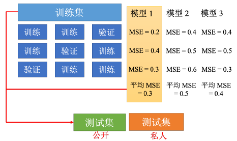

# 实践方法论

## 在训练集上训练失败

在训练集上训练失败的原因常常归因于模型误差（Model bias）和优化（Optimization）策略。那么如何判断是其中何者带来的训练失败呢？常见的思路如下图中。

### 模型误差（Model bias）

模型误差即假设的待优化参数的基本模型与实际要估计的模型有所偏差，即该基本模型对应的函数集合太小，使得损失在合理范围之内的函数不在集合的范围之内。一个很好的比方是，好比想在大海里面捞针（一个损失低的函数），结果针根本就不在海里。

此时，需要重新设计一个模型，使得其更加灵活。可以增加输入的训练集的特征，也可以利用深度学习加深网络，这些方法都可以扩大模型预测的集合，提高模型灵活性。

### 优化策略（Optimization）

一般常用的优化策略是梯度下降算法，随之而来的是这种算法在优化时可能出现的各种问题，这些问题导致模型优化失败，无法得到合适的模型。此时的比方是，想要大海捞针，针确实在海里，但是无法把针捞起来。

具体的梯度下降算法的问题，以及解决方法参见下一章节笔记。

## 在测试集上训练失败

当模型在训练集上能够得到很好的训练结果，此时就要在测试集上进行测试。当在测试集上损失较小的，可能的原因就是过拟合（Overfitting）问题或者不匹配（Mismatch）问题。

### 过拟合问题（Overfitting）

过拟合是指模型在训练集上损失非常小，但是在测试集上损失会变得很大。**常见的导致过拟合的原因是相对于模型的复杂程度，测试集合的数据不够广泛。**因此，要解决过拟合问题要么从训练集入手，对训练集进行数据增强（data augmentation）；要么从模型入手，对模型进行约束（constrained model）。

**解决措施1：数据增强（data augmentation）**

数据增强就是根据问题的理解创造出新的数据。例如，在做图像识别时，常常将训练集中的图像进行左右翻转、裁剪放大等操作，但是不应该对其进行上下颠倒，因为现实中不会出现上下颠倒。如果给机器奇怪的图像进行学习，它就可能学到奇怪的东西。

因此数据增强，要根据数据的特性以及对要处理问题的理解选择合适的数据增强方式。

**解决措施2：模型约束（constrained model）**

常见的方法是：

* 给予模型更少的参数，或者让模型共享某些参数（Less parameters，sharing parameters）。
* 更少的特征，简化输入数据的形式（Less features）。
* 早提技术（Early stopping）。
* 正则化手段（Regularization）。
* 丢弃法（Dropout）。

**交叉验证**

当得到训练良好的模型后，需要对这些模型进行挑选，但是不能仅仅根据测试集的结果进行挑选，因为有可能某些模型在测试集恰好过拟合了。

对于测试集常常分为公开测试集（public test dataset），和私有测试集（private test dataset）。公开测试集相当于最后一次对模型的测试，完成这次测试后模型就将投入使用，将面对各种各样的私有测试集。当模型恰好在公开测试集上过拟合，就会导致其在面对其他私有测试集的时候效果很差。对此的解决措施就是提早演练，即将训练集中的一部分划分出来作为“公开测试集”，而将原有的公开测试集作为”私有测试集“，此时的公开测试集可以作为私有测试集的代表，对模型进行检验。

可以将训练数据划分为两类训练集（training set）和验证集（validation set）。随后采用k折交叉验证（k-fold cross validation）。

k 折交叉验证就是先把训练集切成k 等份。在这个例子，训练集被切成3 等份，切完以后，拿其中一份当作验证集，另外两份当训练集，这件事情要重复3 次。即第1一份第2份当训练，第3份当验证；第1一份第3份当训练，第2份当验证；第1一份当验证，第2份第3份当训练。

### 不匹配问题（Mismatch）

不匹配是指训练集和测试集的分布不同，导致的模型训练损失居高不下。不匹配问题是一种非常严重的问题，不能通过调整模型、更改优化策略、数据增强或者模型约束等手段解决，这是一种根本性的错误。

