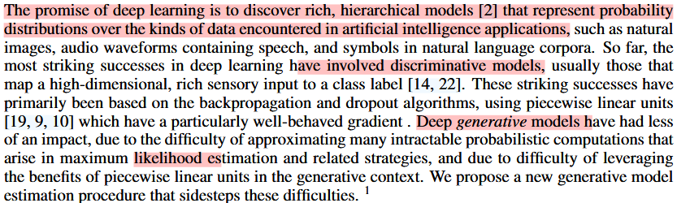
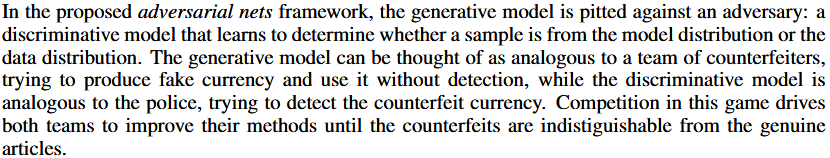
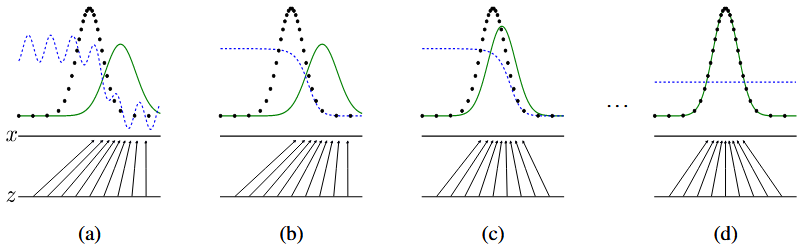
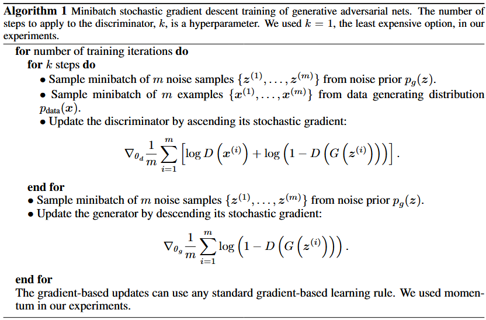
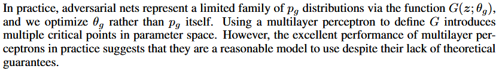

[toc]

# 介绍

## 判别模型和生成模型

## 通俗解释

在所提出的对抗性网络框架中，生成模型与对手进行了对抗：一种判别模型，它学习确定样本是来自模型分布还是数据分布。生成模型可以被认为是类似于一群伪造者，试图生产假币并在不被发现的情况下使用它，而辨别模型则类似于警察，试图检测假币。这场比赛的竞争促使两支球队改进他们的方法，直到假货与真品无法分割。

# 对抗网络

## 损失函数

首先定义一个输入的噪声分布$p_z(z)$，随后从该分布中取出一个$z$，将其放入生成模型$G(z;\theta_g)$中，一般来说G是一个多层感知机，其模型参数用$\theta_g$表示。对于判别模型，将其定义为$D(x;\theta_d)$，对于输入其中的变量$x$会输出一个标量分数，用于表示x来自于预先知道的数据分布的概率，分数越大，概率越高。训练过程中的目标就是尽可能提高$D$的分辨能力，同时也尽可能提高$G$的生成能力，促成生成模型和判别模型的良性竞争。对于$G$训练目标就是使得$log(1-D(G(z)))$的值最小化。

用公式表达，固定$G$的前提下$D$将使得下列值函数$V(G,D)$越大越好，同时固定$D$的前提下$G$将使得该值函数越小越好，最终要求的是使得该值函数最小的$G$和$D$：
$$
\min_{G} \max_{D} V(G, D) = \mathbb{E}_{x \sim p_{\text{data}}(x)}[\log D(x)] + \mathbb{E}_{z \sim p_{z}(z)}[\log(1 - D(G(z)))]
$$

## 代码框架

# 理论分析

## 命题1：全局最优解

当生成器固定时，最佳的判别器如下：
$$
D^*_G(\boldsymbol{x})=\frac{p_{data}(\boldsymbol{x})}{p_{data}(\boldsymbol{x})+p_{g}(\boldsymbol{x})}
$$
相关证明如下：
$$
V(D, G) = \mathbb{E}_{\boldsymbol{x} \sim p_{\text{data}}(\boldsymbol{x})}[\log D(\boldsymbol{x})] + \mathbb{E}_{\boldsymbol{z} \sim p_{z}(\boldsymbol{z})}[\log(1 - D(G(\boldsymbol{z})))]
$$
通过将期望展开，写为如下：
$$
\begin{aligned}
V(G, D) &= \int_{\boldsymbol{x}} p_{\text{data}}(\boldsymbol{x}) \log(D(\boldsymbol{x})) d\boldsymbol{x} + \int_{\boldsymbol{z}} p_{\boldsymbol{z}}(\boldsymbol{z}) \log(1 - D(g(\boldsymbol{z}))) d\boldsymbol{z} \\
 &= \int_{\boldsymbol{x}} \left[ p_{\text{data}}(\boldsymbol{x}) \log(D(\boldsymbol{x})) + p_{g}(\boldsymbol{x}) \log(1 - D(\boldsymbol{x})) \right] d\boldsymbol{x}
 \end{aligned}
$$
注意对于单映射，特定的$z$生成对应的$x$，计算$p_z(z)$就是判断变量$z$属于分布$z$的概率，这和计算$z$通过$G$生成对应的$x$属于分布$g_x$的概率是一样的，也就可以将上述式子展开。中括号中的式子$ p_{\text{data}}(\boldsymbol{x}) \log(D(\boldsymbol{x})) + p_{g}(\boldsymbol{x}) \log(1 - D(\boldsymbol{x}))$，是一个凸函数，在$D(\boldsymbol{x})=\frac{p_{data}(\boldsymbol{x})}{p_{data}(\boldsymbol{x})+p_{g}(\boldsymbol{x})}$时，取得最大值。

当判别器达到理论最优判别器时，也就是$D(\boldsymbol{x})=D^*(\boldsymbol{x})=\frac{p_{data}(\boldsymbol{x})}{p_{data}(\boldsymbol{x})+p_{g}(\boldsymbol{x})}$。
$$
\begin{align*}
C(G) &= \max_{D} V(G, D) \\
&= \mathbb{E}_{x \sim p_{\text{data}}} \left[ \log D_G^*(x) \right] + \mathbb{E}_{z \sim p_z} \left[ \log \left( 1 - D_G^*(G(z)) \right) \right] \\
&= \mathbb{E}_{x \sim p_{\text{data}}} \left[ \log D_G^*(x) \right] + \mathbb{E}_{x \sim p_g} \left[ \log \left( 1 - D_G^*(x) \right) \right] \\
&= \mathbb{E}_{x \sim p_{\text{data}}} \left[ \log \frac{p_{\text{data}}(x)}{p_{\text{data}}(x) + p_g(x)} \right] + \mathbb{E}_{x \sim p_g} \left[ \log \frac{p_g(x)}{p_{\text{data}}(x) + p_g(x)} \right]
\end{align*}
$$
此时，对于生成器输出的变量$x$，如果生成其好无比，判别器无法将其分开，即$p_{data}=p_{g}$，判别器输出$\frac{1}{2}$，上式可以写为：
$$
\begin{aligned}
C(G)_{G_{best}}&= \mathbb{E}_{x \sim p_{\text{data}}} \left[ \log\frac{1}{2}\right] + \mathbb{E}_{x \sim p_g} \left[ \log\frac{1}{2} \right]\\
&= \mathbb{E}_{x \sim p_{\text{data}}} \left[ -\log2\right] + \mathbb{E}_{x \sim p_g} \left[ -\log2 \right]\\
&= -\log2\int_{\boldsymbol{x}} \left[ p_{data}(\boldsymbol{x})  + p_{g}(\boldsymbol{x}) \right] d\boldsymbol{x}\\
&= -2\log{2}=-\log4
\end{aligned}
$$
KL（Kullback-Leibler）散度用于衡量两个分布的差异，起源于信息论。信息论的主要目标是量化数据中有多少信息。信息论中最重要的指标称为熵，通常表示为$H$。

定义如下：
$$
KL(p||q)=\sum_{i=1}^Np(x_i)(\log{p(x_i)}-\log{q(x_i)})
$$
KL散度看的是原始分布中的数据概率与近似分布之间的对数差的期望。
$$
\begin{aligned}
KL(p||q)&=\mathbb{E}_{x_i\sim p}(\log{p(x_i)}-\log{q(x_i)})\\
&=\mathbb{E}_{x_i\sim p}(\log{\frac{p(x_i)}{q(x_i)}})\\
\end{aligned}
$$
利用KL散度，可以精确地计算出当一个分布相对另一个分布损失了多少信息。

接下来让我们回到GAN的证明。
$$
\begin{aligned}
C(G) &= \mathbb{E}_{x \sim p_{\text{data}}} \left[ \log \frac{p_{\text{data}}(x)}{p_{\text{data}}(x) + p_g(x)} \right] + \mathbb{E}_{x \sim p_g} \left[ \log \frac{p_g(x)}{p_{\text{data}}(x) + p_g(x)} \right]\\
&= \mathbb{E}_{x \sim p_{\text{data}}} 
\left[ \log \frac{\frac{1}{2}p_{\text{data}}(x)}{\frac{1}{2}(p_{\text{data}}(x) + p_g(x))} \right] 
+ \mathbb{E}_{x \sim p_g} 
\left[ \log \frac{\frac{1}{2}p_g(x)}{\frac{1}{2}(p_{\text{data}}(x) + p_g(x))} \right]\\
&= \mathbb{E}_{x \sim p_{\text{data}}}\log(\frac{1}{2}) + \mathbb{E}_{x \sim p_{\text{g}}} \log(\frac{1}{2}) + KL(p_{\text{data}}||\frac{p_\text{data}+p_g}{2})
+ KL(p_{\text{g}}||\frac{p_\text{data}+p_g}{2})
\end{aligned}
$$
对于最好的$G$而言，有$p_{data}=p_{g}$，故上式子可以写为：
$$
C(G)_{G_{\text{best}}}= -\log{4} + KL(p_{\text{data}}||\frac{p_\text{data}+p_g}{2})
+ KL(p_{\text{g}}||\frac{p_\text{data}+p_g}{2})
$$
转换为JS散度如下：
$$
C(G)_{G_{\text{best}}}= -\log{4} + 2JSD(p_{data}||p_g)
$$
由于两个分布之间的Jensen-Shannon散度始终为非负，并且仅在它们相等时才为零，因此$C^*=-\log4$ 是$C(G)$的全局最小值，唯一的解为$p_g = p_{data}$，即当生成模型完美复制了原始数据生成过程时，损失值函数$V(G,D)$取到最小值。

## 命题2：程序的收敛性

如果G和D有足够的表达能力，在每一步使得辨别器在给定生成器下达到最优解，同时Pg也被更新以来优化损失：
$$
\mathbb{E}_{\boldsymbol{x}\sim p_{data}}[\log{D^*_{G}(\boldsymbol{x})}] + \mathbb{E}_{\boldsymbol{x}\sim p_{g}}[\log(1-{D^*_{G}(\boldsymbol{x})})]
$$
那么生成器产生的分布$p_g$就会逐渐收敛至$p_{data}$。

# 结论和未来工作

1. 条件生成模型$p(x|c)$可以通过将条件$c$作为输入添加到$G$和$D$来获得。
2. 图像编辑
3. 图像填充和超分辨率
4. 半监督学习，当标记数据有限时，来自鉴别器或推理网络的特征可以提高分类器的性能。
5. 改进训练方式，通过更好的方法来协调 G 和 D，或在训练期间确定更好的样本 z 分布。

# 学习附录

[一文读懂信息熵、交叉熵和相对熵（KL散度） - 知乎](https://zhuanlan.zhihu.com/p/593362066)

[理解JS散度(Jensen–Shannon divergence)-CSDN博客](https://blog.csdn.net/weixin_44441131/article/details/105878383)

[Kullback-Leibler(KL)散度介绍 - 知乎](https://zhuanlan.zhihu.com/p/100676922)

[生成对抗网络GAN开山之作论文精读_哔哩哔哩_bilibili](https://www.bilibili.com/video/BV1oi4y1m7np/?spm_id_from=333.337.search-card.all.click&vd_source=41bae495d2931a7e6b683f50a0923307)

[第六节 2021 - 生成式对抗网络(GAN) (一) – 基本概念介紹_哔哩哔哩_bilibili](https://www.bilibili.com/video/BV1Wv411h7kN?spm_id_from=333.788.videopod.episodes&vd_source=41bae495d2931a7e6b683f50a0923307&p=58)

[2021 - 生成式对抗网络(GAN) (二) – 理论介绍与WGAN_哔哩哔哩_bilibili](https://www.bilibili.com/video/BV1Wv411h7kN?spm_id_from=333.788.videopod.episodes&vd_source=41bae495d2931a7e6b683f50a0923307&p=59)

[2021 - 生成式对抗网络(GAN) (三) – 生成器效能评估与条件式生成_哔哩哔哩_bilibili](https://www.bilibili.com/video/BV1Wv411h7kN?spm_id_from=333.788.videopod.episodes&vd_source=41bae495d2931a7e6b683f50a0923307&p=60)

[2021 - 生成式对抗网络(GAN) (四) – Cycle GAN_哔哩哔哩_bilibili](https://www.bilibili.com/video/BV1Wv411h7kN?spm_id_from=333.788.videopod.episodes&vd_source=41bae495d2931a7e6b683f50a0923307&p=61)
