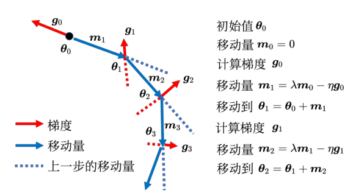

[toc]

# 优化算法的选择

## 优化问题

优化问题的一般形式可以写成如下形式：
$$
minmize\ f(x)\ \ \ \ subject\ to\ x\in C
$$
其中，$subject\ to\ x \in C$可以具体化为如下：
$$
C=\{x|h_1(x)=0,\cdots,h_m(x)=0,g_1(x)\le0,\cdots,g_r(x)<0\}
$$
如果$C=R^n$就是不受限，对于深度学习一般不对变量设限制。

## 局部极小值与鞍点

## 梯度下降算法

梯度下降算法是一种非常基本的求解优化问题的方法，适合对神经网络这种大参数量的数学模型进行最优化问题求解。梯度算法可以分为三种：随机梯度下降算法，批量梯度下降算法和小批梯度下降算法

## 动量梯度下降算法

**动量**

动量（momentum method）梯度下降算法来源于物理学中的动量概念：当雪球从山上滚下来时，它积累的动量，越滚越快，有助于脱离训练过程中的鞍点和局部最小值点。

一般的基于梯度的参数更新方法如：$\theta_{i+1} = \theta_{i}-\eta g_i$，引入动量概念后如：$\theta_{i+1}=\theta_i-\eta g_i + \lambda m_i$，这里的$\lambda m_i$相当于将之前模型参数更新方向的一个打包考虑，其中包含了小球在之前积累的动量，示意图如下：

这样在模型每一步优化参数的过程中，参数的更新不仅考虑当前位置的梯度信息，还考虑了之前模型的更新信息。根据打包“动量”方式的不同，基于动量梯度下降有非常多种的优化器，例如`Adam`，`Adam-w`以及`RMSProp`等优化器。

**`Adam`优化器**

`Adam`优化器代表自适应矩阵估计（adaptive moment estimation）。`Adam`算法保留了历史梯度的指数衰减平均，相当于动量。如果这里的动量概念被视为从斜坡下滚落小球的惯性力，那么`Adam`就相当于进一步将摩擦力考虑进去，摩擦力用于较少和控制动量。`Adam`的性能通常优于其他优化器，因为它训练神经网络的速度比之前介绍的技术要快得多。

## 专业名词释义

| 名词       | 解释 |
| ---------- | ---- |
| `SGD`      |      |
| `Momentum` |      |
| `AdaGrad`  |      |
| `RMSProp`  |      |
| `AdaDelta` |      |
| `Adam`     |      |

