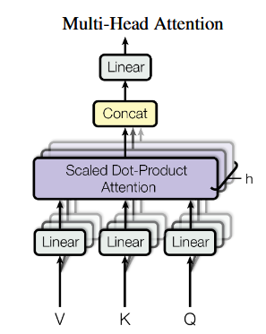
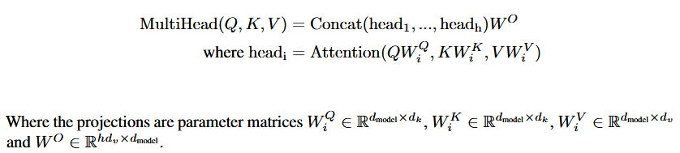

# 手写多头注意力机制

## 解析





在手写多头注意力机制之前，应当明确，多头注意力机制并不会该百年输入序列的特征长度和序列长度，仅仅是考虑上下文后对序列的重组。

## 代码

```python
# multi_head_self_attention.py

import torch
import torch.nn as nn
import math

class Multi_Head_Self_Attention(nn.Module):
    def __init__(self, dim_feature, num_heads, attention_dropout=0.1):
        super(Multi_Head_Self_Attention,self).__init__()
        self.dim_feature = dim_feature
        self.num_heads = num_heads
        self.dim_heads = dim_feature // num_heads
        # actually nn.Linear(dim_feature, num_heads * dim_heads)
        self.q_proj = nn.Linear(dim_feature, dim_feature)
        self.k_proj = nn.Linear(dim_feature, dim_feature)
        self.v_proj = nn.Linear(dim_feature, dim_feature)
        self.out_proj = nn.Linear(self.dim_feature, self.dim_feature)

        self.attention_dropout = nn.Dropout(attention_dropout)

    def forward(self, x, attention_mask=None):
        # x(b, seq, dim_feature)
        batch, seq_len, _ = x.size()
        # x = x.view(-1, self.dim_feature)
        Q = self.q_proj(x)
        K = self.k_proj(x)
        V = self.v_proj(x)
        # Q, K, V (b, seq, dim_feature) -> (b, seq, num_heads, dim_head)
        q_state = Q.view(batch, seq_len, self.num_heads, self.dim_heads)
        k_state = K.view(batch, seq_len, self.num_heads, self.dim_heads)
        v_state = V.view(batch, seq_len, self.num_heads, self.dim_heads)
        # (b, seq, num_heads, dim_head) -> (b, num_heads, seq, dim_head)
        q_state = q_state.transpose(1,2)
        k_state = k_state.transpose(1,2)
        v_state = v_state.transpose(1,2)

        attention_weight = torch.matmul(
            q_state, k_state.transpose(-1, -2)
        )/math.sqrt(self.dim_heads)
        # attention_weight (b, num_heads, seq, seq)
        if attention_mask is not None:
            attention_weight = attention_weight.masked_fill(
                attention_mask == 0, 
                float('-inf')
            )
        # print(attention_weight.shape)

        attention_weight = torch.softmax(attention_weight, dim=-1)
        attention_weight = self.attention_dropout(attention_weight)
        output_mid = torch.matmul(
            attention_weight, v_state
        ) # (b, num_heads, seq, dim_head) -> (b, seq, num_heads * dim_head)

        output_mid = output_mid.transpose(1,2).contiguous()
        output_mid = output_mid.view(batch, seq_len, -1)
        output = self.out_proj(output_mid)
        return output

if __name__ =='__main__':
    attention_mask = (
        torch.tensor([[0, 1],[0, 1],[1, 0]]).unsqueeze(1).unsqueeze(2).expand(3,8,2,2)

    )
    x = torch.rand(3, 2, 128)
    print('input shape: ', x.shape)
    net = Multi_Head_Self_Attention(128, 8)
    print('output shape: ', net(x,attention_mask).shape)
    print(net(x,attention_mask))
```

