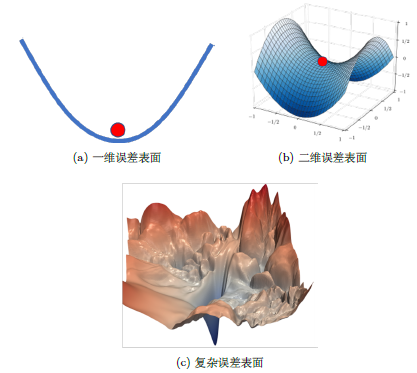
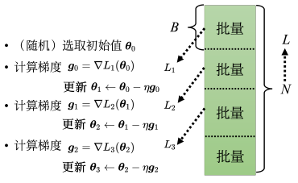

[toc]

## `tensorboard`——记录工具的使用

## `numpy`与`pandas`——常见的工具

### `numpy`


### `pandas`

### `tqdm`

## `Pytorch`——开始深度学习

### `Pytorch`的构成以及深度学习常规流程

```
|__ torch
|	|__ torch.nn
|	|__ torch.functional
|	|__ torch.utils
|		|__ torch.utils.data
|			|__ torch.utils.data.dataloader
|		|__ torch.utils.tensorboard
|   		
|__torchvision
```

### 数据的组织与划分

#### 现有数据集类的使用


#### 自定义数据集类的使用


#### 数据集的加载与划分

使用类`Dataloader`对数据集进行加载和batch的划分，以及其他各种操作。

### 神经网络模型的搭建

#### 卷积层

##### 一维卷积

```python
torch.nn.Conv1d(in_channels, out_channels, kernel_size, stride=1, 
                padding=0, dilation=1, groups=1, bias=True,
                padding_mode='zeros', device=None, dtype=None)
```


##### 二维卷积

```python
torch.nn.Conv2d(in_channels, out_channels, kernel_size, stride=1, 
                padding=0, dilation=1, groups=1, bias=True, 
                padding_mode='zeros', device=None, dtype=None)
```


##### 三维卷积

```python
torch.nn.Conv3d(in_channels, out_channels, kernel_size, stride=1, 
                padding=0, dilation=1, groups=1, bias=True, 
                padding_mode='zeros', device=None, dtype=None)
```


#### 池化层

#### 非线性激活层

#### 全连接层

#### 常见容器的使用

### 损失函数的选择

```python
torch.nn.L1Loss(size_average=None, reduce=None, reduction='mean')
```

用于测量输入 x 和目标 y中每个元素之间的平均绝对误差 (MAE)。
$$
L=\{l_1, l_2, ..., l_N\}^T, l_n=|\hat{y}_n - y_n|
$$

$$
l(\hat{y}, y)=
\left\{
\begin{array}{l}
mean(L), if\ reduction = 'mean'\\
sum(L), if\ reduction ='sum'\\
L, if\ reduction = 'none'\\
\end{array}
\right.
$$

#### MESLoss

```python
torch.nn.MSELoss(size_average=None, reduce=None, reduction='mean'
```

$$
L=\{l_1, l_2, ..., l_N\}^T, l_n=(\hat{y}_n - y_n)^2
$$

$$
l(\hat{y}, y)=
\left\{
\begin{array}{l}
mean(L), if\ reduction = 'mean'\\
sum(L), if\ reduction ='sum'\\
L, if\ reduction = 'none'\\
\end{array}
\right.
$$


### 优化方法的选择

在pytorch中`torch.optim`模块实现了多种优化算法的实现。

| 优化器名称        | 主要特点       | 使用场景           |
| ----------------- | -------------- | ------------------ |
| SGD(随机梯度下降) | 简单基础       | 基础教学、简单模型 |
| Adam              | 自适应学习率   | 大多数深度学习任务 |
| RMSprop           | 适应学习率     | RNN网络            |
| Adagrad           | 参数独立学习率 | 稀疏数据           |


## 深度学习训练技巧


### 在训练集上训练失败

在训练集上训练失败的原因常常归因于模型误差（Model bias）和优化（Optimization）策略。那么如何判断是其中何者带来的训练失败呢？常见的思路如下图中。


#### 模型误差（Model bias）

模型误差即假设的待优化参数的基本模型与实际要估计的模型有所偏差，即该基本模型对应的函数集合太小，使得损失在合理范围之内的函数不在集合的范围之内。一个很好的比方是，好比想在大海里面捞针（一个损失低的函数），结果针根本就不在海里。

此时，需要重新设计一个模型，使得其更加灵活。可以增加输入的训练集的特征，也可以利用深度学习加深网络，这些方法都可以扩大模型预测的集合，提高模型灵活性。

#### 优化策略（Optimization）

一般常用的优化策略是梯度下降算法，随之而来的是这种算法在优化时可能出现的各种问题，这些问题导致模型优化失败，无法得到合适的模型。此时的比方是，想要大海捞针，针确实在海里，但是无法把针捞起来。

具体的梯度下降算法的问题，以及解决方法参见下一章节笔记。

### 在测试集上训练失败

当模型在训练集上能够得到很好的训练结果，此时就要在测试集上进行测试。当在测试集上损失较小的，可能的原因就是过拟合（Overfitting）问题或者不匹配（Mismatch）问题。

#### 过拟合问题（Overfitting）

过拟合是指模型在训练集上损失非常小，但是在测试集上损失会变得很大。**常见的导致过拟合的原因是相对于模型的复杂程度，测试集合的数据不够广泛。**因此，要解决过拟合问题要么从训练集入手，对训练集进行数据增强（data augmentation）；要么从模型入手，对模型进行约束（constrained model）。

**解决措施1：数据增强（data augmentation）**

数据增强就是根据问题的理解创造出新的数据。例如，在做图像识别时，常常将训练集中的图像进行左右翻转、裁剪放大等操作，但是不应该对其进行上下颠倒，因为现实中不会出现上下颠倒。如果给机器奇怪的图像进行学习，它就可能学到奇怪的东西。

因此数据增强，要根据数据的特性以及对要处理问题的理解选择合适的数据增强方式。

**解决措施2：模型约束（constrained model）**

常见的方法是：

* 给予模型更少的参数，或者让模型共享某些参数（Less parameters，sharing parameters）。
* 更少的特征，简化输入数据的形式（Less features）。
* 早提技术（Early stopping）。
* 正则化手段（Regularization）。
* 丢弃法（Dropout）。

**交叉验证**

当得到训练良好的模型后，需要对这些模型进行挑选，但是不能仅仅根据测试集的结果进行挑选，因为有可能某些模型在测试集恰好过拟合了。

对于测试集常常分为公开测试集（public test dataset），和私有测试集（private test dataset）。公开测试集相当于最后一次对模型的测试，完成这次测试后模型就将投入使用，将面对各种各样的私有测试集。当模型恰好在公开测试集上过拟合，就会导致其在面对其他私有测试集的时候效果很差。对此的解决措施就是提早演练，即将训练集中的一部分划分出来作为“公开测试集”，而将原有的公开测试集作为”私有测试集“，此时的公开测试集可以作为私有测试集的代表，对模型进行检验。

可以将训练数据划分为两类训练集（training set）和验证集（validation set）。随后采用k折交叉验证（k-fold cross validation）。

k 折交叉验证就是先把训练集切成k 等份。在这个例子，训练集被切成3 等份，切完以后，拿其中一份当作验证集，另外两份当训练集，这件事情要重复3 次。即第1一份第2份当训练，第3份当验证；第1一份第3份当训练，第2份当验证；第1一份当验证，第2份第3份当训练。


#### 不匹配问题（Mismatch）

不匹配是指训练集和测试集的分布不同，导致的模型训练损失居高不下。不匹配问题是一种非常严重的问题，不能通过调整模型、更改优化策略、数据增强或者模型约束等手段解决，这是一种根本性的错误。


## 深度学习优化技巧

### 局部极小值与鞍点

#### 临界点及其种类

#### 判断临界值种类的方法

使用泰勒级数近似（Tayler series approximation）将损失函数在临界点处展开。
$$
L(\theta)\approx L(\theta')+(\theta-\theta')^Tg+\frac{1}{2}(\theta-\theta')^TH(\theta-\theta')
$$
$g$代表梯度，$H$代表海森矩阵（Hessian matrix）。海森矩阵中存放的是$L$的二次微分，它第$i$行，第$j$列的结果就是把$\theta$的第i个元素对$L(\theta')$做微分，再把$\theta$的第j个元素对$\frac{\partial L(\theta')}{\partial \theta_i}$作微分。

当位于临界点处，$g=0$，因此上式改写为：
$$
L(\theta)\approx L(\theta')+\frac{1}{2}(\theta-\theta')^TH(\theta-\theta')
$$
用向量$v$表示$\theta-\theta'$，故上式又可改写为：
$$
L(\theta)\approx L(\theta')+\frac{1}{2}v^THv
$$

1. 如果对于$v$，$v^THv>0$，这意味着$L(\theta)<L(\theta')$，这是一个局部极小值点。
2. 如果对于$v$，$v^THv<0$，这意味着$L(\theta)>L(\theta')$，这是一个局部极大值点。
3. 如果对于$v$，$v^THv<0$与$v^THv>0$均存在，这是一个鞍点。

算出一个海森矩阵后，不需要把它跟所有的$v$都乘乘看，只要看$H$的特征值。若$H$的所有特征值都是正的，$H$为正定矩阵，则$v^THv > 0$，临界点是局部极小值。若H 的所有特征值都是负的，$H$为负定矩阵，则$v^THv < 0$，临界点是局部极大值。若$H$的特征值有正有负，临界点是鞍点。

#### 逃离鞍点的方法

$H$不只可以帮助我们判断是不是在一个鞍点，还指出了参数可以更新的方向。设$\lambda$为$H$的一个特征值$\lambda$，$u$为其对应的特征向量。对于我们的优化问题，可令$u=\theta-\theta'$，则：
$$
u^THu=u^T(\lambda u)=\lambda||u||^2
$$
将此时带入得：
$$
L(\theta)\approx L(\theta')+\lambda||u||^2
$$
若$\lambda<0$，则$\lambda||u||^2<0$，$L(\theta)<L(\theta')$，且$\theta = \theta'+u$，沿着$u$的方向更新$\theta$，损失就会变小。故，在鞍点时，沿着负的特征值对应的特征向量的方向，就可以继续降低损失，模型进行优化。

但是由于海森矩阵需要计算二次微分，计算代价过大，所以几乎没有人用这个方法来逃离鞍点，因为还有一些其他逃离鞍点的方法计算量远小于海森矩阵的方法。

---

*讲到这边会有一个问题：鞍点跟局部极小值谁比较常见？鞍点其实并没有很可怕，如果我们经常遇到的是鞍点，比较少遇到局部极小值，那就太好了。*

*科幻小说《三体III：死神永生》中有这样一个情节：东罗马帝国的国王君士坦丁十一世为对抗土耳其人，找来了具有神秘力量的做狄奥伦娜。狄奥伦娜可以于万军丛中取上将首级，但大家不相信她有这么厉害，想要狄奥伦娜先展示下她的力量。于是狄奥伦娜拿出了一个圣杯，大家看到圣杯大吃一惊，因为这个圣杯本来是放在圣索菲亚大教堂地下室的一个石棺里面，而且石棺是密封的，没有人可以打
开。狄奥伦娜不仅取得了圣杯，还自称在石棺中放了一串葡萄。于是君士坦丁十一世带人撬开了石棺，发现圣杯真的被拿走了，而是棺中真的有一串新鲜的葡萄，为什么迪奥伦娜可以做到这些事呢？是因为狄奥伦娜可以进入四维的空间。从三维的空间来看这个石棺是封闭的，没有任何路可以进去，但从高维的空间来看，这个石棺并不是封闭的，是有路可以进去的。误差表面会不会也一样呢。*



---

最小值比例（minimum ration），最小值比例代表正特征值数量和总特征值数量的比值。而在研究人员的实践中发现，几乎找不到所有特征值都为正的临界点，也就是说从经验上看，局部极小值并没有那么常见，多数时候损失不再变化仅仅是遇到了鞍点。

结合三体的故事，我的理解是，目前的深度学习往往会设计非常多的参数，多参数意味着模型的多维度，而只要维度足够高那么它总能找到在低维中找不到了路，这也就是为什么局部极小值十分少见。

### 批量和动量

实际上在计算梯度 的时候，并不是对所有数据的损失`L`计算梯度，而是把所有的数据分成一个一个的批量（batch）。即每个批量的大小为B，即带有B个数据，每次更新数据都会



#### 批量大小对梯度下降算法的影响

批量大小和计算速度

批量大小和损失计算

有时小的batchsize在训练集的效果上更好，一种有误差的损失函数计算有时反而利于梯度下降

小的batchsize会引起过拟合。


### 自适应学习率（adaptive learning rate）


此时梯度没有变为0，但是loss并没有下降，这是因为此时学习率已经不再适合了，此时损失函数将在一个山谷中来回震荡。当时若

固定的学习率不能适应损失函数的任何情况，需要自动调整学习率以使其适应损失函数不同的位置。

AdaGrad

RMSProp


Adam

### 学习率调度

### 批量归一化

#### 批量归一化的由来

在依据训练函数对特征进行训练求解时，崎岖不平的损失函数往往使得训练过程十分困难。而前文所讲的改良方法都是从优化算法的角度进行改良，批量归一化则是从目标函数的角度对优进行改进。


如上图所示，从特征的角度看，使得损失函数变得崎岖的原因可能是因为不同特征之间的数值差距很大。如下示意图，对于一个双参数的损失函数来说，当一个参数对应的特征数量级远远大于另一个参数对应的特征时，特征在这个方向上哪怕发生很小的变化，由于大特征，也会导致损失函数发生很大的变化，导致损失函数的平面等高线沿着这个大特征的参数方向被压扁。反之，当两个特征数量级接近时，损失函数的平面登高线图就会变的更加均匀和平滑。


所以尽可能使得不同特征处在接近的数量级之间，就可以制造比较平滑均匀的误差表面，简化训练过程。这种使得特征更加接近的方法就叫特征归一化（Feature Normalization）。

#### 如何进行特征归一化

进行特征归一化有许多方法，最常见的是使用Z值归一化（Z-score Normalization），也称为标准化。对于一批特征（或样本）中的$m$个特征$x^j={x_1^j,x_2^j,...,x_i^j,...x_n^j},j=1,2,...,m$，计算该特征某个维度上的平均值$m_i=\frac{1}{m}{\sum_{j=1}^{j=m}} x_i^j$（Average）和标准差$\sigma_i$（Standard Deviation），将该维度特征中的所有数据进行如下归一化转换。
$$
\tilde{x}^i_j=\frac{x_j^i-m_i}{\sigma_i}
$$
如此归一化后，，这个维度上面的数值就会平均是0，其方差是1，所以这一排数值的分布就都会在0 上下；对每一个维度都做一样的归一化，所有特征不同维度的数值都在0 上下，可能就可以制造一个比较好的误差表面。

#### 特征归一化与激活函数

#### 特征归一化与批量梯度下降


