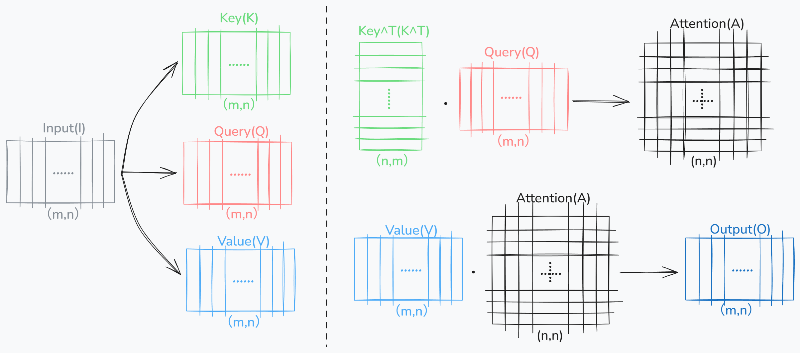

---
title:自注意力机制
data:2025/8/7
categories:深度学习
tag：
  -深度学习
  -自注意力机制
---

## 背景

全连接层可以将所有特征向量并入网络中进行学习，但是这种方式并没有将向量的上下文信息纳入考察，对于类似语音识别等任务，全连接层并不能很好的完成任务。

为了将上下文信息纳入考虑范围，最简单的方法就是使用一个滑动窗口，将一定范围内的多个特征向量同时输入到神经网络中。这种方法虽然可以将特征向量的上下文信息纳入考虑，但随之带来的则是重复输入的数据和更加复杂的模型，对于一些不得不考虑所有数据的任务来说非常不友好。

为了将所有的上下文信息考察范围的同时，尽可能控制模型的参数量，自注意力机制技术应运而生。自注意力机制可以使得在为特征向量添加上下文信息的同时，保证新产生的特征向量的数量保持不变。

自注意力机制为一个特征生成对应的新特征时，根据该特征的上下文信息与该特征相关程度，为他们**分配不同的注意力**（权重），再将考虑了对应权重的上下文信息和目标特征进行合并，产生新的特征。

## QKV架构

注意力函数可以产生考虑了上下文信息后的特征，$QKV$架构中包含了$Q$、$K$、$V$这三个部分。$Q$、$V$主要用于计算上下文信息的权重（注意力，常见有加法注意力和减法注意力）$\alpha$的大小，将$\alpha$与$V$联合计算后，就可以得到新的考虑了上下文信息的特征值。

注意力函数可以描述为将查询（$Q$）和一组键值对（$K$）映射到输出（$O$），其中查询（$Q$）、键（$K$）、值（$V$）和输出（$O$）都是向量。
$$
A_{(n,n)} = (K^T)_{(n,m)}\times Q_{(m,n)} \\
O_{(m,n)} = V_{(m,n)}\times A_{(n,n)}
$$

* $m$表示特征向量的维度，$n$表示序列的长度。
* $Q$,$K$根据输入特征序列I生成，可以提前预定义，也可以通过学习得到。
* $V$代表输入特征序列I的值。
* $A$代表注意力权重矩阵。元素$\alpha_{ij}$表示第$j$个特征与第$i$个特征的相似度，这边的相似度通过点乘这两个特征向量对应的$q$向量$k$向量得到；第$i$行表示所有特征向量与第$i$个特征向量的相似度；第$j$列表示第$j$个特征向量与所有特征向量的相似度。
* $V\cdot A(:,j)$表示考虑上下文信息的新的第j个特征向量$O(:,j)$。

## 多头注意力机制

在*Attention Is All You Need*中提出一种多头注意力机制，即通过线性层的生成出多个$Q$,$K$,$V$，分别执行点乘注意力机制，最后将输出合并后再输入到线性层中输出。这样神经网络就可以通过数据学习线性层的映射关系，学习多种模式的线性映射关系。

手写多头注意力机制

## Transformer架构

在论文*Attention Is All You Need*中，对权重值的生成进行了对应的优化，优化公式如下：
$$
Attention(Q,K,V)=softmax(\frac{K^TQ}{\sqrt{d_k}})V
$$
改进1：添加$softmax$函数。归一化处理

改进2：添加分母项$\sqrt{d_k}$。防止$softmax$的梯度过小

## 参考