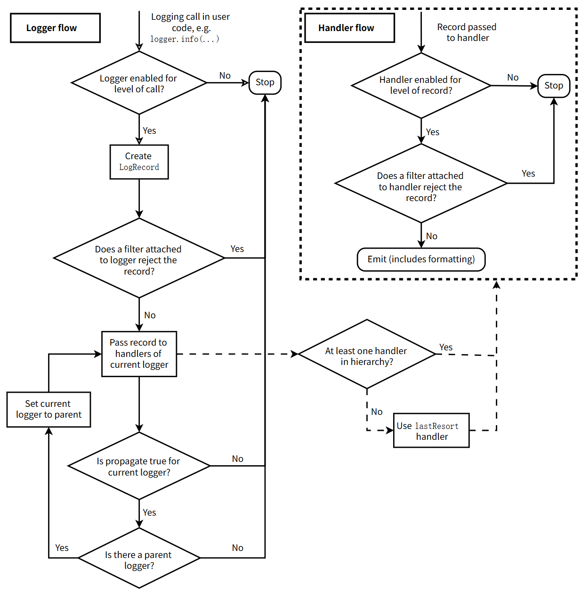
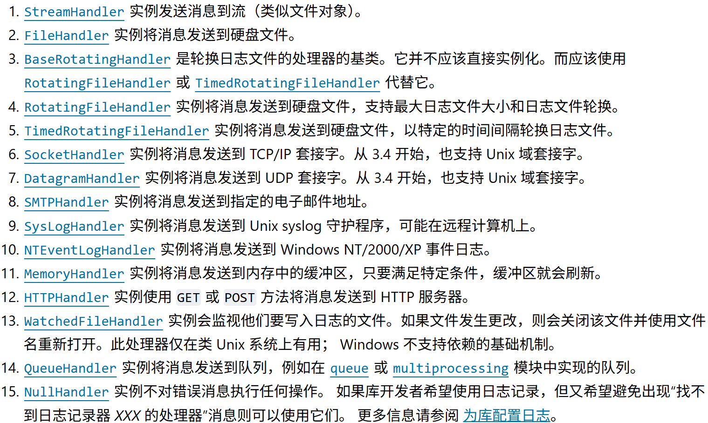

[toc]

# Logging模块的使用



## 日志级别

日志级别用于控制日志的详细程度。`logging`模块提供了一下几种日志级别：

- `DEBUG`：详细的调试信息，通常用于开发阶段。
- `INFO`：程序正常运行时的信息。
- `WARNING`：表示潜在的问题，但程序仍能正常运行。
- `ERROR`：表示程序中的错误，导致某些功能无法正常工作。
- `CRITICAL`：表示严重的错误，可能导致程序崩溃。

**默认的级别是`WARNING`，意味着只会追踪该严重程度及以上的事件，除非 logging 包另有其他配置。**

## 快速入门

使用代码行`logger=getLogger(__name__)`快速创建一个记录器，然后调用该记录器的`debug()`，`info()`，`warning()`，`error()`，`critical()`方法来使用日志记录功能。

```python
>>> import logging
>>> logging.warning('Watch Out!')
WARNING:root:Watch Out!
>>> logging.info('I told you so')
>>>
```

如果你在命令行中输入这些代码并运行，你将会看到：`WARNING:root:Watch Out!`在控制台上打印出来。`INFO`消息没有出现是因为默认级别为`WARNING`。

请注意在这个例子中，我们是直接使用`logging`模块的函数，比如`logging.debug`，而不是创建一个日志记录器并调用其方法。 这些函数是在根日志记录器上操作的，但它们在未被调用时将会调用`basicConfig()`来发挥作用，就像在这个例子中那样。 然而在更大的程序中你通常会需要显式地控制日志记录的配置 —— 所以出于这样那样的理由，最好还是创建日志记录器并调用其方法。

### 记录日志到文件

```python
import logging
logger = logging.getLogger(__name__)
logging.basicConfig(filename='example.log', encoding='utf-8', level=logging.DEBUG)
logger.debug('This message should go to the log file')
logger.info('So should this')
logger.warning('And this, too')
logger.error('And non-ASCII stuff, too, like Øresund and Malmö')
```

现在，如果我们打开日志文件，我们应当能看到日志信息：

```
DEBUG:__main__:This message should go to the log file
INFO:__main__:So should this
WARNING:__main__:And this, too
ERROR:__main__:And non-ASCII stuff, too, like Øresund and Malmö
```

该示例同样展示了如何设置日志追踪级别的阈值。该示例中，由于我们设置的阈值是`DEBUG`，所有信息都将被打印。

对`basicConfig()`的调用应当在任何对日志记录器方法的调用如`debug()`,`info()`等之前执行。否则，日志记录事件可能无法以预期的方式来处理。

如果多次运行上述脚本，则连续运行的消息将追加到文件*example.log*。如果你希望每次运行重新开始，而不是记住先前运行的消息，则可以通过将上例中的调用更改为来指定*filemode*参数:

```python
logging.basicConfig(filename='example.log', filemode='w', level=logging.DEBUG)
# 可以使用filemode='a'，每次输入不会覆盖上次的输入
```

输出将与之前相同，但不再追加进日志文件，因此早期运行的消息将丢失。

### 记录变量数据

要记录变量数据，请使用格式字符串作为事件描述消息，并附加传入变量数据作为参数。 例如:

```python
import logging
logging.warning('%s before you %s', 'Look', 'leap!')
```

将显示：

```
WARNING:root:Look before you leap!
```

### 更改显示消息的格式

要更改用于显示消息的格式，你需要指定要使用的格式:

```
import logging
logging.basicConfig(format='%(levelname)s:%(message)s', level=logging.DEBUG)
logging.debug('This message should appear on the console')
logging.info('So should this')
logging.warning('And this, too')
```

这将输出：

```
DEBUG:This message should appear on the console
INFO:So should this
WARNING:And this, too
```

### 在消息中显示时间

要显示事件的日期和时间，你可以在格式字符串中放置` '%(asctime)s'`

```
import logging
logging.basicConfig(format='%(asctime)s %(message)s')
logging.warning('is when this event was logged.')
```

应该打印这样的东西：

```
2010-12-12 11:41:42,612 is when this event was logged.
```

如果你需要更多地控制日期/时间的格式，请为 `basicConfig` 提供 *datefmt* 参数，如下例所示:

```
import logging
logging.basicConfig(format='%(asctime)s %(message)s', datefmt='%m/%d/%Y %I:%M:%S %p')
logging.warning('is when this event was logged.')
```

这会显示如下内容：

```
12/12/2010 11:46:36 AM is when this event was logged.
```

## 常用组件

### 记录器：`Logger`类

```
Logger = logging.getLogger(name=None)
Logger:
	|_1_ Logger.setLevel()
	|_2_ Logger.addHandler()/Logger.removeHandler()
	|_3_ Logger.addFilter()/Logger.removeFilter()
	|_4_ Logger.debug()/Logger.info()/Logger.warning()/Logger.error()/Logger.critical()
```

`logging.getLogger(name=None)`

返回一个由`name`指定名称的日志记录器，或者如果`name`为`None`则返回层级结构中的根日志记录器。如果指定了`name`，它通常是以点号分隔的带层级结构的名称如 *'a'*, *'a.b'* 或 *'a.b.c.d'*。 这些名称的选择完全取决于使logging的开发者，不过就如在记录器对象中提到的那样建议使用`__name__`，除非你有不这样做的特别理由。

在分层列表中较低的记录器是列表中较高的记录器的子项。例如，给定一个名为`foo`的记录器，名称为`foo.bar`、`foo.bar.baz`和`foo.bam`的记录器都是`foo`子项。

记录器具有**有效等级**的概念。如果**未**在记录器上显式设置级别，则使用其**父记录器**的级别作为其**有效级别**。如果**父记录器**没有明确的级别设置，则检查其父级。**依此类推，搜索所有上级元素，直到找到明确设置的级别。**根记录器始终具有明确的级别配置（默认情况下为 `WARNING` ）。在决定是否处理事件时，记录器的有效级别用于确定事件是否传递给记录器相关的处理器。

**子记录器将消息传播到与其父级记录器关联的处理器。**因此，**不必为**应用程序使用的所有记录器定义和配置处理器。一般为顶级记录器配置处理器，再根据需要创建子记录器就足够了。（但是，你可以通过将记录器的 *propagate* 属性设置为 `False` 来关闭传播。）

### 处理器：`Handler`类

`Handler`对象负责将适当的日志消息（基于日志消息的严重性）分派给处理器的指定目标。

`Logger`对象可以使用`addHandler()`方法向自己添加零个或多个处理器对象。作为示例场景，应用程序可能希望将**所有日志消息发送到日志文件**，**将错误或更高的所有日志消息发送到标准输出**，**以及将所有关键消息发送至一个邮件地址**。 此方案需要三个单独的处理器，其中每个处理器负责将特定严重性的消息发送到特定位置。

标准库包含很多处理器类型，如下截图，一般常用的就是`StreamHandlder()`和`FileHandler()`。



```
Handler = logging.FileHandler(file_path)
Handler
	|__ setLevel()
	|__ setFormatter()
	|__ addFilter()/removeFilter()
```

### 格式器：`Formatter`类

格式化器对象配置日志消息的最终顺序、结构和内容。格式化器的构造函数有三个可选参数——消息格式字符串、日期格式字符串和样式指示符。

`logging.Formatter.__init__(fmt=None, datefmt=None, style='%')`

详细写法参见LogRecord 属性

## LogRecord 属性

两种格式化方法：{}-格式化`str,format()`和$-格式化`string.Template`。

| 属性名称        | 格式                         | 描述                                                         |
| :-------------- | :--------------------------- | :----------------------------------------------------------- |
| args            | 此属性不需要用户进行格式化。 | 合并到 `msg` 以产生 `message` 的包含参数的元组，或是其中的值将被用于合并的字典（当只有一个参数且其类型为字典时）。 |
| asctime         | `%(asctime)s`                | 表示人类易读的 [`LogRecord`](https://docs.python.org/zh-cn/3/library/logging.html#logging.LogRecord) 生成时间。 默认形式为 '2003-07-08 16:49:45,896' （逗号之后的数字为时间的毫秒部分）。 |
| created         | `%(created)f`                | 当 [`LogRecord`](https://docs.python.org/zh-cn/3/library/logging.html#logging.LogRecord) 被创建的时间（即 [`time.time_ns()`](https://docs.python.org/zh-cn/3/library/time.html#time.time_ns) / 1e9 所返回的值）。 |
| exc_info        | 此属性不需要用户进行格式化。 | 异常元组（例如 `sys.exc_info`）或者如未发生异常则为 `None`。 |
| filename        | `%(filename)s`               | `pathname` 的文件名部分。                                    |
| funcName        | `%(funcName)s`               | 函数名包括调用日志记录.                                      |
| levelname       | `%(levelname)s`              | 消息文本记录级别（`'DEBUG'`，`'INFO'`，`'WARNING'`，`'ERROR'`，`'CRITICAL'`）。 |
| levelno         | `%(levelno)s`                | 消息数字的记录级别 ([`DEBUG`](https://docs.python.org/zh-cn/3/library/logging.html#logging.DEBUG), [`INFO`](https://docs.python.org/zh-cn/3/library/logging.html#logging.INFO), [`WARNING`](https://docs.python.org/zh-cn/3/library/logging.html#logging.WARNING), [`ERROR`](https://docs.python.org/zh-cn/3/library/logging.html#logging.ERROR), [`CRITICAL`](https://docs.python.org/zh-cn/3/library/logging.html#logging.CRITICAL)). |
| lineno          | `%(lineno)d`                 | 发出日志记录调用所在的源行号（如果可用）。                   |
| message         | `%(message)s`                | 记入日志的消息，即 `msg % args` 的结果。 这是在唤起 [`Formatter.format()`](https://docs.python.org/zh-cn/3/library/logging.html#logging.Formatter.format) 时设置的。 |
| module          | `%(module)s`                 | 模块 (`filename` 的名称部分)。                               |
| msecs           | `%(msecs)d`                  | [`LogRecord`](https://docs.python.org/zh-cn/3/library/logging.html#logging.LogRecord) 被创建的时间的毫秒部分。 |
| msg             | 此属性不需要用户进行格式化。 | 在原始日志记录调用中传入的格式字符串。 与 `args` 合并以产生 `message`，或是一个任意对象 (参见 [使用任意对象作为消息](https://docs.python.org/zh-cn/3/howto/logging.html#arbitrary-object-messages))。 |
| name            | `%(name)s`                   | 用于记录调用的日志记录器名称。                               |
| pathname        | `%(pathname)s`               | 发出日志记录调用的源文件的完整路径名（如果可用）。           |
| process         | `%(process)d`                | 进程ID（如果可用）                                           |
| processName     | `%(processName)s`            | 进程名（如果可用）                                           |
| relativeCreated | `%(relativeCreated)d`        | 以毫秒数表示的 LogRecord 被创建的时间，即相对于 logging 模块被加载时间的差值。 |
| stack_info      | 此属性不需要用户进行格式化。 | 当前线程中从堆栈底部起向上直到包括日志记录调用并引发创建当前记录堆栈帧创建的堆栈帧信息（如果可用）。 |
| thread          | `%(thread)d`                 | 线程ID（如果可用）                                           |
| threadName      | `%(threadName)s`             | 线程名（如果可用）                                           |
| taskName        | `%(taskName)s`               | [`asyncio.Task`](https://docs.python.org/zh-cn/3/library/asyncio-task.html#asyncio.Task) 名称（如果可用）。 |

## 附录

### 参考

[logging --- Python 的日志记录工具 — Python 3.13.7 文档](https://docs.python.org/zh-cn/3/library/logging.html#logger-objects)

[日志指南 — Python 3.13.7 文档](https://docs.python.org/zh-cn/3/howto/logging.html#logging.logging.Formatter.__init__)

### 常用模板

```python
def create_filelogger(logger_name, logger_path):
    # define logger
    logger = logging.getLogger(logger_name)
    logger.setLevel(logging.INFO)
    logger.propagate = False
    # define hander
    hander = logging.FileHandler(logger_path)
    # define formatter
    formatter = logging.Formatter('%(asctime)s - %(message)s')
    # assemble
    hander.setFormatter(formatter)
    logger.addHandler(hander)

    return logger
```

使用时，如下：

```python
train_logger = create_logger('train_logger', config['log_train_path'])
train_logger.info(f'Epoch {epoch} Step{step} Loss{loss_train} Acc{acc_train}')
```

