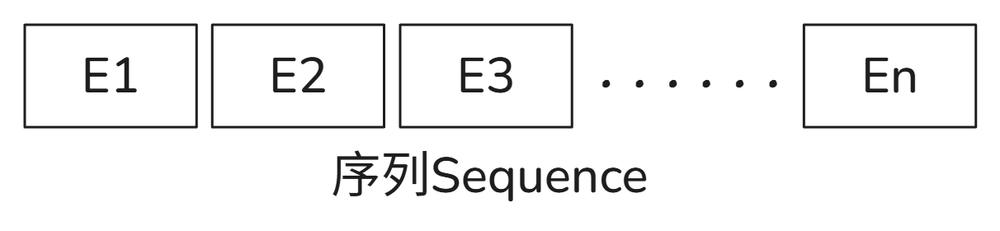

---

---

## 模型架构

### 编码器和解码器(Encoder and Decoder Stacks)

### 注意力机制(Attention)

这里的功能函数是用于计算注意力的权重值的，不同的论文有不同的计算方法，最常见的方法有点积和累加这两种。这篇论文在点积的基础上又添加了一些修改，在得到点积值后，将该值除以向量的长度，并使用`softmax`函数加权到0-1之间。

> [!NOTE]
>
> 在得到点积值后，将该值除以向量的长度？

$$
V=[v_1, v_2, v_3,\cdots, v_n]\\
Q=[q_1, q_2, q_3,\cdots, q_n]\\
K=[k_1, k_2, k_3,\cdots, k_n]
$$

$$
Attention(Q,K,V)=softmax(\frac{Q^TK}{\sqrt{(d_k)}})\\
=softmax(
\left[
\begin{array}{c}
q_1k_1 & q_1k_2 & \cdots & q_1k_n\\
q_2k_1 & q_2k_2 & \cdots & q_2k_n\\
\vdots & \vdots & \vdots & \vdots\\
q_nk_1 & q_nk_2 & \cdots & q_nk_n\\
\end{array}
\right])/\sqrt{d_k}
$$

多头的注意力机制(Multi-Head Attention)

> [!NOTE]
>
> 为什么要使用多头？

### Position-wise Feed-Forward Networks

### Embeddings and SoftMax

### Embeddings and SoftMax

## 代码实现